# 一、Web API & DOM

## 1、Web API

是浏览器提供的一套操作**浏览器功能**和**页面元素**的**API**(BOM和DOM)，现阶段主要是针对浏览器讲解一些常用的API

## 2、什么是DOM?

文档对象模型简称DOM，是W3C组织推荐的处理可扩展标记语言（HTML或XML）的标准编程接口

## 3、DOM结构：(DOM树)

（1）文档：一个页面就是一个文档，DOM中使用document表示
（2）元素：页面中的所有标签都是元素，DOM中使用element表示
（3）节点：网页中的所有内容都是节点（标签、属性）note
ps:DOM把以上内容都看做是对象

# 二、获取页面元素-DOM

DOM在实际开发中主要用来操作元素，获取元素有以下几种方式

## 1、根据ID获取：getElementById()

（1）参数id是大小写敏感的**字符串**（里面的是字符串）
（2）返回的是一个元素对象

```
var timer =  document.getElementById('time');
console(timer);
```

```dir```:打印返回的元素对象,更好的查看里面的属性和方法

```
console.dir(timer);
```

## 2、根据标签名获取：getElementsTagName('标签名')

使用```getElementsTagName('标签名')```的方法可以返回带有指定标签名的对象的集合
（1）直接使用返回的是 获取过来元素对象的集合（是以伪数组的形式存储的）

```
var lis = document.getElementsTagName('li');  //获取HTML写的li标签 
console.log(lis); // 输出[li,li,li]等(每一个li里面都有各种属性值)
console.log(lis[0]); //输出第一个li的内容

//如果想要依次打印里面的元素对象可以采取遍历的方式
for (var i = 0; i< lis.length; i++){
    console.log(lis[i]);
}
```

ps:
因为得到的是一个对象的集合，所以想要操作里面的元素就要用到遍历
得到的元素对象是动态的（也就是说改变li里面的内容script里面的元素动态也会改变）
如果页面中只有一个标签li,返回的还是伪数组的形式
如果页面中只有没有标签li,返回的是空的伪数组形式[]

（2）获取某个元素（父元素）内部所有指定标签名的子元素：
&emsp;&emsp;**element.getElementsByTagName('标签名')**
父元素必须是**单个对象/元素（必须指明是哪一个元素对象）**，获取的时候不包括父元素自己（因此伪数组元素不能做单个对象（父元素），也就是不能使用document.getElementsTagName来获取父元素），只能用单个对象做父元素

```
HTML结构：
    <ol id= 'getMoreOl'>
        <li>测试2</li>
        <li>测试2</li>
        <li>测试2</li>
    </ol>

JS结构：
var getOl = document.getElementsByTagName('ol'); //这里输出[ol]数组
console.log(getOl[0].getElementsByTagName('li'));  不能写成console.log(getOl.getElementsByTagName('li'))，否则就不是单一对象而是数组了

另外一种常用写法：使用id先获取父元素
var getOl2 = document.getElementById('getMoreOl');
console.log(getOl2.getElementsByTagName('li')); 
```

## 3、通过HTML5新增的方法获取

（1）document.getElementsByClassName：根据类名获得某些元素集合

```
HTML结构：
    <div class="box"></div>
    <div class="box"></div>
JS结构：
var box = document.getElementsByClassName('box');
```

（2）document.querySelector('选择器')：根据指定选择器返回**第一个元素对象**
ps:里面的选择器要加符号，类名加. id类型加#

```
var firstBox = document.querySelector('.box'); //选取类名选择器的第一个元素
var nax = document.querySelector('#nav'); //选取id选择器里面的第一个元素
var getLi = document.querySelector('li');  //选取第一个li
```

（3）document.querySelectorAll('选择器')：根据指定选择器返回所有元素对象集合

```
var allBox = document.querySelectorAll('.box'); //选择所有类名选择器为box的对象
var getLi = document.querySelectorAll('li');
```

## 4、获取特殊元素（body、html）

（1）获取body元素：```document.body``` (返回body元素对象)
（2）获取html元素：```document.documentElement``` (返回html元素对象)

# 三、事件基础

## 1、事件三要素： 事件源 事件类型 事件处理程序

（1）事件源：事件被出发的对象
（2）事件处理类型：如果触发事件，比如鼠标点击（onclick），鼠标经过，键盘按下等
（3）事件处理程序：通过一个函数赋值的方式完成

```
HTML结构：
<button id = 'btn'>测试</button>
例如： var btn = document.getElementById('btn'); //事件源
btn.onclick = function() {
    alert('这样就行啦');
}
```

## 2、获取事件的三个步骤

（1）获取事件源
（2）注册事件（绑定事件）
（3）添加事件处理程序（采用函数赋值形式）

# 四、操作元素

JS的DOM操作可以改变网页内容、结构和样式，可以利用DOM操作元素来改变元素里面的内容、属性

## 1、改变元素内容

（1）```element.innerText```:从起始位置到终止位置的内容，但会去除html标签，同时空格和换行也会去掉
ps:元素也可以不用添加事件

```
HTML结构：
<button>点下按钮div里面的盒子会出现现在的时间</button>
<div></div>
//1、获取元素
var btn = document.querySelector('button');
var getDiv = document.querySelector('div');
//2、注册事件
btn.onclick = function() {
     //也可以不写onclick，直接写成：getDiv.innerText = getDate()； 这样就是刷新页面的时候自动出来
    getDiv.innerText = getDate();  //改变元素内容
}

function getDate() {
    //格式化年月日
    var date = new Date();
    var year = date.getFullYear();
    var month = date.getMonth + 1; //月份是从0开始算的
    var dates = date.getDate();
    var arr = ['星期日','星期一','星期二','星期三','星期四','星期五','星期六']  
    //星期是从周日开始算的
    var day = getDay();
    return '今天是：' + year + '年' + month + '月' + day + '日' + arr[day]; 
```

（2）```element.innerHTML```:从起始位置到终止位置的内容，包括html标签，同时保留空格和换行
&emsp;&emsp;&emsp;```和innerText```的区别：
```innerText```不识别html标签,而```innerHTML```是识别html标签的

```
var getDiv = document.querySector('div');
getDiv.innerText = '这里的加粗<strong>无法显示</strong>';  //输出这里的加粗<strong>无法显示</strong>
getDiv.innerHTML = '这里的加粗<strong>可以显示</strong>';  //输出这里的加粗可以显示，其中可以显示表示出加粗效果
//innerHTML还可以直接加标签
li.innerHTML = text.value + "<a herf='#'>删除</a>";
```

这两个属性都是可读写的，可以获取元素里的内容

## 2、改变常用元素的属性操作

src、href、id、alt、title等
用img.src这样的修改方式进行修改(用img元素的src属性)

```
img.src = 'images/hello.png'
```

## 3、改变表单元素的属性操作

type,value,checked,selected,disabled
ps:修改表单value不能用```input.innerHTML```,因为这个只对普通盒子有效比如div标签的内容

```
HTML结构：
    <button></button>
    <input type="search" value="">
JS结构：
var btn = document.querySelector('button');
var getInput = document.querySelector('input');
btn.onclick = function {
    getInput.value = '被点击了';
    btn.disabled = ture; //某个表单按了一次之后被禁用
    也可以写成：
    this.disabled = ture; //this指向的是事件函数的调用者btn
}
```

## 4、修改样式属性

（1）```element.style```:行内样式操作(样式比较少或者功能比较简单时使用)
ps:JS里面的样式采取驼峰命名法，比如fontSize,backgroundColor
JS修改style样式操作产生的是行内样式，css权重比较高

```
getDiv（获取的元素名）.style.fontSize = '14px';
或者 this.style.fontSize = '15px';
```

（2）```element.className```:类名样式操作（适用于样式比较多或功能比较复杂的情况：另外样式写在css里面）

```
类名.className = 'change'; //把change类名的CSS样式加入其中
this.className = 'first change';
//如果直接更改会覆盖原有的类名，如果想保留就加上原有的类名例如first在加空格新的类名
```

失去焦点：onblur 获得焦点：onfucus
例如表单里面的值的长度：getInput.value.length != 0;

## 5、自定义属性的操作

（1）获取属性值
element.属性
element.getAttribute('属性');

区别：element.属性是获取内置属性值（元素本身自带的属性）
element.getAttribute('属性');主要获得自定义的属性 例如程序员自定义的属性

```
<div id='demo' index='1'></div>  //index是程序员自己定义的属性
div.id //输出demo,是第一种element.属性的情况
div.getAttribute('id');  //输出demo，是第二种情况
```

（2）设置属性值
element.属性 = '值' //设置内置属性值
element.setAttribute('属性','值');

```
HTML结构：
<div id='demo' index='1' class='nav'></div> 
设置元素属性值：
div.id = 'test'; //输出的id变成test而不是demo
div.className = 'navs'; //加入类名为navs的类

div.setAttribute('index',2); //index不再是1而是2
div.setAttribute('class','footer') //class特殊，这里不再是写className而是直接class
```

（3）移除属性
```element.removeAttribute('属性')```

```
div.removeAttribute('index'); //移除了index属性
```

（4）H5自定义属性
目的：为了保存并使用数据，有些数据可以保存到页面中而不用保存到数据库中
新增了自定义属性：以data-开头作为属性名并赋值的

```
例如<div data-index = '1'></div>
或者用JS设置
element.setAttribute('data-index',2)
```

获取H5新增自定义属性：```element.getAttribute('data-index');``` 常用这个
H5新增```element.dataset.类名```(例如上面的index) 或者 ```element.dataset['类名例如index']```

# 五、案例

## 1、排他思想

如果有同一组元素，想要某个元素实现某种样式，需要用到循环的排他思想算法：
（1）所有元素全部清除样式
（2）给当前元素设置样式
（3）注意顺序不能颠倒

```
HTML结构：
    <button>按钮</button>
    <button>按钮</button>
    <button>按钮</button>
    <button>按钮</button>
    <button>按钮</button>
JS结构：
        //排他思想
        // 获取所有元素按钮
        var btns = document.getElementsByTagName('button');
        // btns得到的是伪数组 里面的每一个元素是btn[i]
        for(var i = 0; i < btns.length; i++){
            btns[i].onclick = function(){
                //先把所有按钮背景颜色去除
                for(var i = 0; i < btns.length; i++){
                    btns[i].style.backgroundColor = '';
                }
                //然后让当前元素的背景颜色变为pink
                this.style.backgroundColor = 'pink';
            }
        }
```

## 2、表单经过变色

新的鼠标事件：鼠标经过 ```Onmouseover``` 鼠标离开 ```onmouseout```

# 六、节点操作

## 1、概述

获取元素通常使用两种方法：利用DOM提供的方法获取元素和利用节点层级关系获取元素（逻辑性强但是兼容性差）
网页中所有的内容都是节点（标签、属性、文本、注释等），在DOM中，节点用node来表示

一般节点至少拥有nodeType(节点类型)、nodeName(节点名称)和nodeValue(节点值)三个基本属性
元素节点nodeType为1
属性节点nodeType为2
文本节点nodeType为3（文本节点包含文字、空格、换行等）
在实际开发中，节点操作主要操作的是元素节点

## 2、节点层级

（1）父节点 ```parentNode```:得到的是离元素最近的父级节点，如果没有则返回为空

```
属性名.parentNode
<div class='box'>
    <span class = 'erweima'></span>
</div>
console.log(erweima.parentNode); 
```

(2)子节点
```parentNode.childNodes``` 返回值包含所有的子节点，包括元素节点，文本节点（换行、空格）等，一般不用
```parentNode.children```是一个只读属性，返回所有的子元素节点，只返回子元素节点 常用这个

```
console.log(ul.children)
```

返回第一个/最后一个子元素节点
```parentNode.firstElementChild```
```parentNode.lastElementChild```
但是有兼容性问题

```
console.log(ol.firstElementChild);
//实际开发的写法
console.log(ol.children[0]); //获取的子元素是一个伪数组
console.log(ol.children[ol.children.length - 1]); //当子元素数量不定时
```

（3）兄弟节点
```node.nextElementSibling```:返回当前元素下一个兄弟元素节点
```node.previousElementSibling```:返回当前元素前一个兄弟元素节点

（4）创建节点+添加节点
```document.createElement('tagName')```:创建由tagName指定的HTML元素，也成为动态创建元素节点

添加节点：
```node.appendChild()```:将一个节点添加到指定父节点的子节点列表末尾，类似CSS的after伪元素(node是父级，child是子级、后面追加元素类似于数组中的push)
```node.insertBefore(child,指定元素)```:将一个节点添加到指定父节点的子节点前面，类似CSS的before伪元素

```
<ul>
    <li>124</li>
</ul>
//1、创建元素节点
var li = document.createElement('li');
//2、添加元素节点
var ul = document.querySelector('ul');
ul.appendChild(li);
//3、添加节点node.insertBefore(child,指定元素)；
var lili = document.creatElement('li');
ul.insertBefore(lili, ul.children[0]);
//记住：想要页面添加一个新的元素：1、创建元素 2、添加元素
```

（5）删除节点
```node.removeChild(child)```：从DOM中删除一个子节点，返回删除的节点

```
<ul>
    <li></li>*3
</ul>

//1、获取元素
var ul = document.querySelector('ul');
var btn = document.querySelector('button');
//2、删除元素 node.removeChild(child)
做成点击按钮依次删除里面的孩子
btn.onclick = function() {
    if (ul.children.length == 0){
        this.disabled = true; //被禁用
    }else {
        ul.removeChild(ul.children[0]);
    }
}
```

ps:阻止链接跳转需要添加```javascript:void(0);```或者```javascript:;```

```
例如：<a herf='javascript:;'>删除</a>
```

（6）复制节点（克隆节点）
```node.cloneNode()```:返回调用该方法的节点的一个副本，也成为克隆节点
ps:如果括号参数为空或者为false，则是浅拷贝，也就是只克隆复制节点本身，不克隆里面的子节点
如果括号参数为true，则是深度拷贝，会复制节点本身和里面的子节点

```
<ul>
    <li>1</li>
    <li>2</li>
    <li>3</li>
</ul>
<script>
    var ul = document.querySelector('ul');
    var lili = ul.children[0].cloneNode(true);
    ul.appendChild(lili);
</script>
```

（7）三种动态创建元素区别
```document.write()```:是直接将内容写入页面的内容流，但是文档流执行完毕会导致页面重绘
```element.innerHTML```:是将内容写入某个DOM节点，不会导致页面重绘
```document.createElement()```
**innerHTML创建多个元素效率更高（不要使用拼接字符串而是采取数组形式拼接），但是结构稍微复杂，而createElement()创建多个元素效率稍微低一些，但是结构更清晰**

# 七、DOM总结

文档对象模型简称DOM，是W3C组织推荐的处理可扩展标记语言（HTML或XML）的标准编程接口
W3C已经定义了一系列的DOM接口，通过这些接口可以改变网页的内容、结构和样式

对于JS,为了能够使JS操作HTML，javascript就有了一套自己的dom编程接口
对于HTML,dom使得html形成一颗dom树，包含文档、元素、节点
（1）文档：一个页面就是一个文档，DOM中使用document表示
（2）元素：页面中的所有标签都是元素，DOM中使用element表示
（3）节点：网页中的所有内容都是节点（标签、属性）note

关于dom操作，主要针对于元素的操作，主要有创建、增、删、改、查、属性操作、事件操作

获取元素通常使用两种方法：利用DOM提供的方法获取元素和利用节点层级关系获取元素（逻辑性强但是兼容性差）
网页中所有的内容都是节点（标签、属性、文本、注释等），在DOM中，节点用node来表示

## 1、创建

（1）document.write
（2）innerHTML(innerText)
（3）createElement

## 2、增

（1）appendChild
（2）insertBefore

## 3、删

（1）removeChild

## 4、改

（1）修改元素属性：src、herf、title等
（2）修改普通元素内容：innerHTML、innerText
（3）修改表单元素：value、type、disabled等
（4）修改元素样式：style、className

## 5、查：主要获取查询dom的元素(获取元素)

（1）DOM提供的API方法：getElementById、getElementByTagName 古老用法不推荐使用
（2）H5提供的新方法：querySelector、querySelectorAll 提倡
（3）利用节点操作获取元素：父(parentNode)、子(children)、兄(previousElementSibling、nextElementSibling) 提倡

## 6、属性操作：主要针对自定义属性

（1）getAttribute:得到dom的属性值
（2）setAttribute:设置dom的属性值
（3）removeAttribute:移除属性

## 7、事件操作

给元素注册事件，采取 事件源.事件类型 = 事件处理程序
（1）document.write
（2）innerHTML
（3）createElement

# 八、事件高级

## 1、注册事件

给元素添加事件，称为注册事件或者绑定事件；注册事件有两种方式：传统方式和方法监听注册方式
（1）传统注册方式：
&emsp;&emsp;利用on开头的onclick，特点是注册事件的唯一性（即同一个元素同一个事件只能设置一个处理函数，最后注册的处理函数将会覆盖前面注册的处理函数）

（2）方法监听注册方式addEventListener：事件监听方式，W3C标准推荐方式
```eventTarget.addEventListener(type,listener[, useCapture])```:是将指定的监听器注册到eventTarget(目标对象)上，当该对象触发指定的事件时，就会执行事件处理程序
该方法接收三个参数：
type:事件类型字符串，比如click、mouseover，注意这里不要带on
listener:事件处理函数，事件发生时，会调用该监听函数
useCapture:可选参数，是一个布尔值，默认是false

```
var btns = document.querySelectorAll('button')
btn[1].addEventListener('click',function(){
    alert(22);  //当点击时则出现22
})
```

## 2、删除事件（解绑事件）

（1）传统注册方式：```eventTarget.onclick = null;```
（2）方法监听注册方式：```eventTarget.removeEventListener(type, listener[, useCapture]);```

```
<div>1</div>
<div>2</div>
<div>3</div>

vae divs = document.querySelector('div);
div[1].addEventListener('click',fn)  //这里的fn不需要调用所以不用加小括号
function fn() {
    alert(22);
    div[1].removeEventListener('click',fn);
}
```

## 3、DOM事件流

（1）事件流描述的是从页面中接收事件的顺序；事件发生时会在元素节点之间按照特定的顺序传播，这个传播过程就是DOM事件流（主要分为三个阶段）
1 捕获阶段（从上往下）
2 当前目标阶段
3 冒泡阶段（从下往上）

（2）JS代码只能执行捕获或者冒泡其中的一个阶段
（3）```onclick```和```attachEvent```只能得到冒泡阶段
（4）```addEventListener(type,listener[, useCapture])```第三个参数如果是true表示在事件捕获阶段调用事件处理程序；如果是false（不写默认是false），表示在事件冒泡阶段调用事件处理程序
（5）实际开发很少使用事件捕获，更关注事件冒泡
（6）有些事件是没有冒泡的，例如onblur,onfocus,onmouseenter,onmouseleave

# 九、事件对象

## 1、基本概述

event就是一个事件对象，写在侦听函数的小括号里面，当成形参来看；但是事件对象只有有了事件才会存在，是系统自动创建的，不需要自己传递参数
event对象代表事件的状态，比如键盘按键的状态、鼠标的位置、鼠标按钮的状态
简单解释就是事件发生后，跟事件相关的一系列信息数据的集合都放在这个对象里面，这个对象就是事件对象event，它有很多属性和方法
例如：谁绑定了这个事件，鼠标/键盘触发事件的话，会得到鼠标/键盘的相关信息，例如鼠标位置/哪个按键

```
eventTarget.onclick = function(event) {
    //这个event就是事件对象，可以自己命名，例如event、evt、e
}
```

## 2、事件对象的常见属性和方法

（1）e.targer返回的是触发事件的对象（元素），而this返回的是绑定事件的对象（元素）
区别：e.traget点击了哪个元素，就返回哪个元素绑定了的这个点击事件，那么就返回谁

```
var ul = document.querySelector('ul');
ul.addEventListener('click'.function(e)){
    console.log(this);
    console.log(e.targe);
}
```

（2）e.traget:返回触发事件的对象(非标准ie6-8使用e.srcElement)

（3）e.type:返回事件的类型 例如click mouseover 不带on

```
//返回事件类型
var div = document.querySelector('div);
div.addEventListener('click',fn);
div.addEventListener('mouseout',fn);

function fn(e){
    console.log(e.type)
}
```

（4）e.preventDefault:组织链接不跳转

```
//阻止默认行为（事件） 让链接不跳转或者提交按钮不提交
var a = document.querySelector('a');
a.addEventListener('click',function(e)) {
    e.preventDefault(); //dom标准写法
}

//传统注册方法
a.onclick = function(e) {
    //普通浏览器 e.preventDefault(); 是一种方法
    //低版本浏览器 returnValue();  是一种属性
}
```

其他：e.stopPropagation()  阻止冒泡标准

## 3、事件委托（代理、委派）

原理：**不是每个子节点单独设置事件监听器，而是事件监听器设置在其父节点上，然后利用冒泡原理影响设置每个子节点**
例如：给ul注册点击事件，然后利用事件对象的target来找到当前点击的li，因为点击li,事件会向上冒泡到ul上，而ul有注册事件，就会触发事件监听器

## 4、常用的鼠标事件

（1）事件处理程序
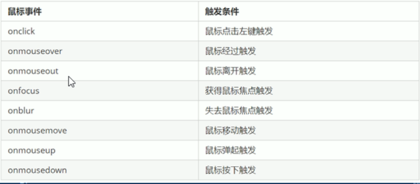

（2）鼠标事件对象：
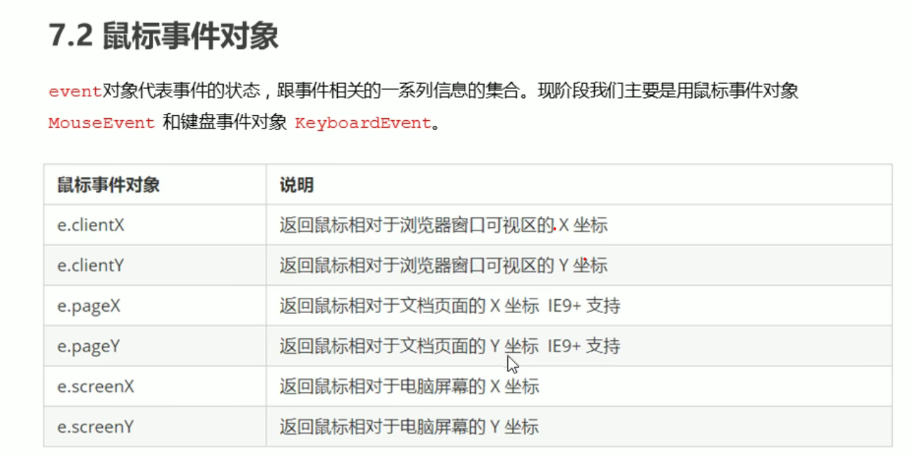
常用e.pageX和e.pageY

（3）案例：跟随鼠标的天使
思路：鼠标不断移动，使用鼠标移动事件：mousemove
在页面中移动，给document注册事件
图片要移动距离，而且不占有位置，因此要使用绝对定位
核心原理：每次鼠标移动，都会获得鼠标坐标，把这个x和y坐标做为图片的top和left值就可以移动图片（注意绝对定位要添加top: px），因为没有px获得的就只是数字，在获得的值后也要加上px

## 5、常见的键盘事件

onkeyup:某个键盘按键被松开时触发，不区分字母大小写
onkeydown:某个键盘按键被按下时触发，不区分字母大小写
onkeypress:某个键盘按键被按下时触发 但是它不识别功能键，比如 ctrl、shift箭头、左右键
实际开发中更多使用keydown和keyup，因为它能识别所有的键
ps：如果使用addEventListener则不需要加On
三个事件的执行顺序是：keydown--keypress--keyup

键盘事件对象的属性：keyCode(返回该键的ASCII值)
```
document.onkeyup = function(){
    console.log('弹起');
}
document.addEventListener('keyup',function(e)){
    console.log('我弹起了');
    console.log(e.keyCode);
}
```
## 6、JS执行队列
（1）先执行执行栈中的同步任务
（2）异步任务（回调函数）放入任务队列中
（3）一旦执行栈中的所有同步任务执行完毕后，系统会按照次序读取任务队列中的异步任务，于是被读取的一部任务结束等待状态，进入执行栈，开始执行
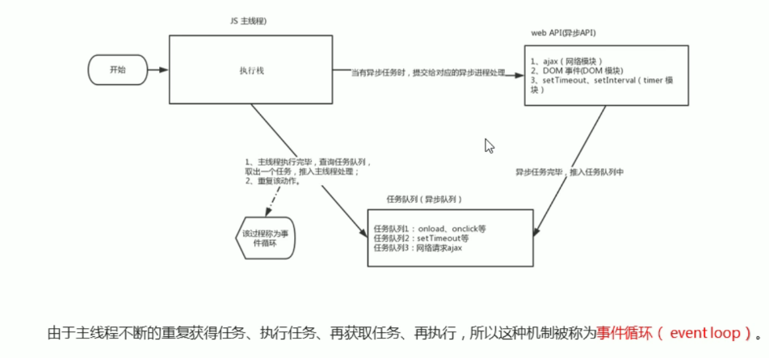

## 7、location对象属性
（1）URL
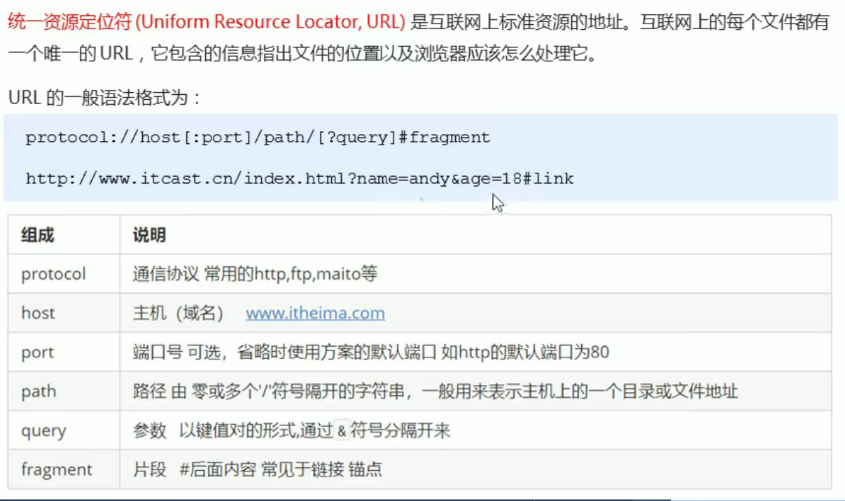

（2）location对象属性
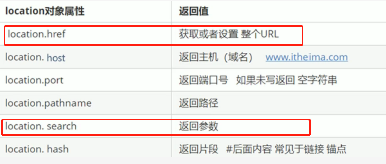

（3）location对象方法
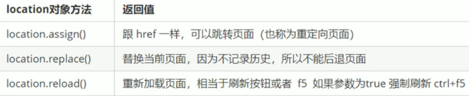
```
var btn = document.querySelector('button');
btn.addEventListener('click',function()) {
    location.assign(http://www.baidu.com);
    location.replace(http://www.baidu.com);
    location.reload(true);
}
```

## 8、history对象属性
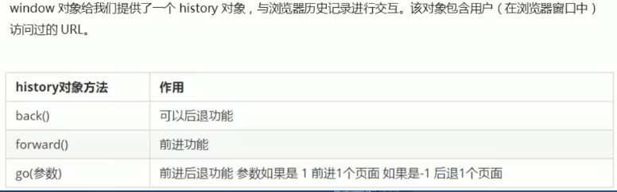

```
var btn = document.querySelector('button');
btn.addEventListener('click',function()) {
    history.back();
    history.go(-1);
}
```

# 十、网页特效
## 1、offset
（1）概述：偏移量，使用offset系列相关属性可以动态的得到该元素的位置（偏移）、大小等
获得
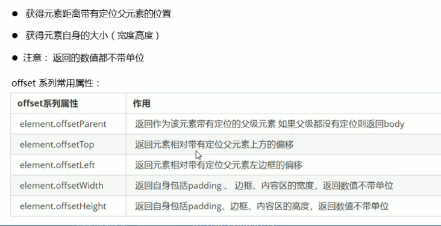

```
1、可以得到元素的偏移 位置 返回不带单位的数值 只能返回上和左的
但是它以带有定位的父亲为准，如果没有父亲或者父亲没有定位则以body为准
console.log(father.offsetTop);
console.log(father.offsetLeft);
2、可以得到元素的大小、宽度和高度 是包含padding+border+width，但是不包含margin
console.log(w.offsetWidth);
console.log(w.offsetHeight);
3、返回带有定位的父亲，否则返回的是body
console.log(son.offsetParent); //父级一定要有定位
console.log(son.parentNode); //返回父亲，是最近一级的父亲 不管父亲有没有定位
```

（2）offset和style的区别
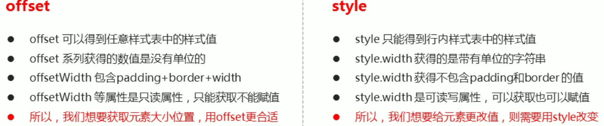

## 2、client
（1）概述：client的相关属性可以获取元素可视区的相关信息，可以动态地得到该元素的边框大小，元素大小（和offset很像，但是不包含边框）
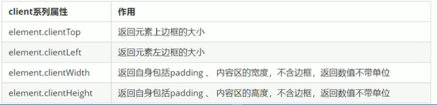

（2）执行函数：主要用于创建一个独立的作用域，避免了命名冲突问题
执行函数写法：(function()){}() 或者 （function(){}()）

## 3、scroll
（1）概述：使用scroll系列的相关属性可以动态的得到该元素的大小、滚动距离等(和client有些相似，但是获得的是内容的高度，也就是当内容超出盒子大小的时候显示的是文字的宽度)
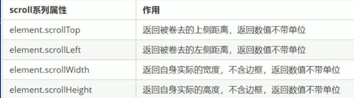

```
div.addEventListener('scroll',function(){
    //scroll滚动事件是当我们滚动条发生变化时触发的事件
    console.log(div.scrollTop);
})
```
ps:页面被卷去的头部是通过```window.pageYOffset```获得的；而元素被卷去头部则是```element.scrollTop```

## 4、**总结：** 
（1）offsetWidth&clientWidth&scrollWidth
```offsetWidth```和其他两个相比，它是包含了border边框的，而其他两个不包含
```clientWidth```和```scrollWidth```的区别是```clientWidth```包括padding和内容的宽度，但是如果内容宽度超过盒子大小则使用```scrollWidth```测量超出的部分

**offset系列经常用于获得元素位置：offsetLeft offsetTop**
**client系列经常用于获得元素大小：clientWidth clientHeight**
**scroll系列经常用于获得滚动距离：scrollTop scrollLeft**
**注意页面滚动距离是通过window.pageXoffset 获得的**

（2）mouseenter鼠标事件
当鼠标移动到元素上时就会触发mouseenter事件
类似mouseover，两者的区别时：```mouseover```鼠标经过自身盒子会触发，经过子盒子还会触发；而```mouseenter```只会经过自身盒子触发（因为```mouseenter```不会冒泡）
而与```mouseenter```搭配的鼠标离开```mouseleave```同样不会冒泡

# 十一、动画函数封装
动画元素的前提必须添加定位（absolute top right）
动画的父级记得要添加定位absolute

```window.scroll(x,y)``` 滚动窗口至页面文档中的特定位置；里面的x和y不加单位，直接是数字
页面滚动了多少是通过使用```window.pageYOffset```得到的

# 十二、DOM移动端事件
## 1、触屏touch事件
（1）```touchstart```:手指触摸到一个DOM元素时触发
（2）```touchmove```:手指在一个DOM元素上滑动时触发
（3）```touchend```:手指从一个DOM元素上移开时触发

## 2、触摸事件对象（TouchEvent）
（1）```touches```:正在触摸屏幕的所有手指的一个列表
（2）```targetTouches```:正在触摸当前DOM元素的一个手指的一个列表
（3）```changedTouches```:手指状态发生了改变的列表，从无到有，从有到无的变化
如果侦听的是同一个DOM元素，则```touches```和```targetTouches```是一样的，但是更常使用```targetTouches```；```targetTouches[0]```列表元素可以获得正在触摸DOM元素的第一个手指的相关信息，比如手指的坐标等；但是当手指离开屏幕时，没有```targetTouches```和```touches```列表，但是有```changedTouched```列表

## 3、移动端拖动元素
（1）```touchstart、touchmove、touchend```可以实现拖动元素
（2）但是拖动元素需要当前的坐标值，可以使用```targetTouch[0]```里面的pageX和pageY
元素拖动思路：

1 触摸元素```touchstart```:获取手指初始坐标，同时获得盒子原来的位置
2 移动手指 ```touchmove```:计算手指的滑动距离并且移动盒子
3 离开手指 ```touchend```
ps:手指移动也会触发滚动屏幕所以要阻止屏幕滚动```e.preventDefault();```

移动端click事件
（1）```classList```:返回元素类名
（2）```classList.add```:添加类名
（2）```classList.remove```:删除类名
（2）```classList.toggle```:切换类名

```
var div = document.querySelector('div');
console.log(div.classList[1]);
div.classList.add('three');
div.classList.remove('one');
div.classList.remove('one');
var btn = document.querySelector('button');
btn.addEventListener('click',function(){
    document.body.classList.toggle('bg');
})
```

click延时解决方案：移动端click事件会有300ms的延时，原因是移动端屏幕双击会缩放页面
解决方案：（1）禁用缩放，浏览器禁用默认的双击缩放行为并且去掉300ms延迟
（2）利用touch事件自己封装这个事件解决300ms延迟