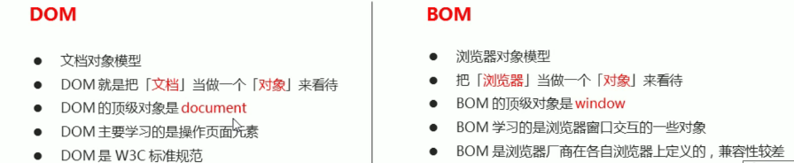
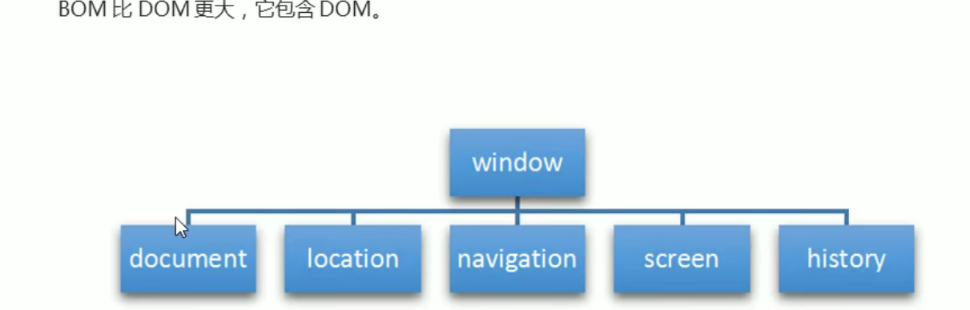

# #目录

>[TOC]

# 一、```BOM```
## 1、概述
```BOM```是浏览器对象模型,是提供独立于内容而与浏览器窗口进行交互的对象,核心对象是window
```BOM```是由一系列相关的对象构成,并且每个对象都提供了很多方法与属性


## 2、```BOM```的构成

window对象是浏览器的顶级对象,具有双重角色:
(1)它是JS访问浏览器窗口的一个接口
(2)他是一个全局对象,定义在全局作用域中的变量,函数都会编程window对象的属性和方法
在调用的时候可以省略window,而window.name是window的一个特殊属性

## 3、窗口加载事件
（1）```window.onload=function()```或者```window.addEventListener("load",function(){});```它是窗口(页面)加载事件,当文档内容完全加载完成会触发该事件
ps:有了```window.onload```就可以把JS代码写到页面元素上方,因为```onload```是等页面内容全部加载完成再去执行处理函数
但是```window.onload```传统注册事件方式只能写一次,如果有多个,会以最后一个```window.onload```为准;而使用```addEventListener```没有限制

```
window.addEventListener('load',function(){
    alert(22);
})

document.addEventListener('DOMcontentLoaded',function(){
    alert(33);
})
load是等页面内容全部加载完,包括页面dom元素,图片,flash,css等
DOMContentLoaded是DOM加载完毕,不包括图片,flash,css等就可以执行了,加载速度比较快
```

（2）调整窗口大小事件
```window.onsize = function(){}```或者```window.addEventListener('resize',function(){});```
是调整窗口大小的加载事件，当触发时就调用的处理函数
ps:如果窗口大小发生像素变化，就会触发这个事件
经常利用这个事件完成响应式布局，```window.innerWidth```当前屏幕的宽度

（3）```setTimeout()```定时器：```window.setTimeout(调用函数，[延迟的毫秒数]);```
这个方法用于设置一个定时器，该定时器在定时器到期后执行调用函数
ps: window可以省略
这个调用函数可以直接写函数，函数名或者字符串'函数名()'三种形式
延迟的毫秒数默认是0，如果写则必须是毫秒
因为定时器可能有很多，所以经常给定时器赋值一个标识符

```
setTimeout(function){
    console.log('这是一种写法);
}
function allback(){
    console.log('这是第二种写法');
}
setTimeout(callback,3000);
```
```setTimeout()```这个调用函数称为**回调函数callback**
普通函数是按照代码顺序直接调用，而回调函数是需要等待时间 等时间到了采取调用这个函数，因此称为回调函数callback
以前的```element.onclick = function()``` 或者 ```element.addEventListener('click'.fn)```里面的函数也是回调函数

（4）停止```setTimeout()```定时器：```window.clearTimeout(timeID)```
```clearTimeout()```方法取消了先前通过调用```setTimeout()```建立的定时器
ps: window可以省略；里面的参数是定时器的标识符（就是函数名字）

（5）```setInterval()```定时器：```window.setInterval(回调函数,[间隔的毫秒数]);```
其他注意事项和```setTimeout()```很相似，但是区别在于：
```setInterval()```方法重复调用一个函数，每隔这个时间就调用一次回调函数，会调用很多次
而```setTimeout```则是延时时间到了，就去调用这个回调函数，只调用一次，就结束了这个定时器

（5）this指向问题：this一般情况下最终指向的是哪个调用它的对象
全局作用域或者普通函数中的this指向全局对象window(**定时器里面的this指向window**)
方法调用中谁调用this指向谁
```
var o = {
    sayHi:function(){
        console.log(this); //this指向的是o这个对象
    }
}
o.sayHi();

var btn = document.querySelector('button');
btn.onclick = function(){
    console.log(this); //this指向的是btn这个按钮对象
}

btn.addEventListener('click'.function(){
    console.log(this); //this指向的是btn这个按钮对象
})
```
构造函数this指向构造函数的实例
```
function Fun(){
    console.log(this); //this指向的是fun 实例对象
}
var fun = new Fun();
```
