#目录

>[TOC]

# 一、javaScript基础总结

## 1、数据类型相关知识点

### Ⅰ-基本(值)类型

>1. String: 任意字符串
>2. Number: 任意的数字
>3. boolean: true/false
>4. undefined: undefined
>5. null: null  -->使用`typeof`时返回`object`
>6. [symbol](https://developer.mozilla.org/zh-CN/docs/Glossary/Symbol) ([ECMAScript](https://developer.mozilla.org/zh-CN/docs/Glossary/ECMAScript) 2016新增)。 -->Symbol 是 [基本数据类型](https://developer.mozilla.org/zh-CN/docs/Glossary/Primitive) 的一种，[`Symbol`](https://developer.mozilla.org/zh-CN/docs/Web/JavaScript/Reference/Global_Objects/Symbol) 对象是 Symbol原始值的[封装 (en-US)](https://developer.mozilla.org/en-US/docs/Glossary/Wrapper) 。
>7. [bigint](https://developer.mozilla.org/zh-CN/docs/Glossary/BigInt)，  -->**BigInt** 是一种数字类型的数据，它可以表示任意精度格式的整数。
>
>加上下方的 [ 对象 ] 类型,目前 javaScript 有八种数据类型

### Ⅱ-对象(引用)类型

>1. Object: 任意对象
>2. Function: 一种特别的`对象`(可以执行)  --内部包含可运行的代码
>3. Array: 一种特别的`对象`(`key`为数值下标属性, 内部数据是有序的)

### Ⅲ-判断方法

#### ①*` typeof`*

>**`typeof`** 操作符返回一个`字符串`，表示未经计算的操作数的类型。
>
>* 可以判断: undefined/ 数值 / 字符串 / 布尔值 / function
>
>* 不能判断: null与object  object与array；数组、对象、null都会被判断为object，其他判断都正确
>
>* `注意`: 运行`console.log(typeof undefined)`时,得到的的也是一个`字符串,同时为小写!!`--> `'undefined'`
>
>* 代码示例
>
> ```js
>   // typeof返回数据类型的字符串表达
>   var a
>
>   //注意:typeof返回的是字符串
>   console.log(a, typeof a, typeof a==='undefined',a===undefined )  // undefined 'undefined' true true
>   console.log(undefined === 'undefined') //false
>
>   a = 4
>   console.log(typeof a==='number') //true
>
>   a = 'hongjilin'
>   console.log(typeof a==='string') //true
>   console.log(typeof a==='String') //false  -->注意,返回的类型为小写
>
>   a = true
>   console.log(typeof a==='boolean') //true
>
>   a = null
>   console.log(typeof a, a===null) // 'object'  true
>  let b={}
>   console.log(typeof b,typeof null, '-------') // 'object' 'object'  -->所以Typeof不能判断null与object
>
>
>var num = 18;
>console.log(typeof num); //这里typeof和变量之间是空格隔开
>
>console.log(typeof 2);               // number
>console.log(typeof true);            // boolean
>console.log(typeof 'str');           // string
>console.log(typeof []);              // object    
>console.log(typeof function(){});    // function
>console.log(typeof {});              // object
>console.log(typeof undefined);       // undefined
>console.log(typeof null);            // object
> ```

#### ②*`instanceof`*(判断实例方法)

>- `专门判断对象`的具体类型,返回的是一个布尔值，函数和数组都是instanceof object相等
>
>- **`instanceof`** **运算符**用于检测构造函数的 `prototype` 属性是否出现在某个实例对象的原型链上。
>
>- 代码示例:
>
> ```js
>   var b1 = {
>     b2: [1, 'abc', console.log],
>  //可以简化成 b3:()=>()=> 'hongjilin'  -->高阶函数相关知识
>     b3: function () {
>       return  () =>{  return   'hongjilin'}
>     }
>   }
>  /**使用instanceof进行对象判断*/
>   console.log(b1 instanceof Object, b1 instanceof Array) // true  false
>   console.log(b1.b2 instanceof Array, b1.b2 instanceof Object) // true true，后面的object也是true
>   console.log(b1.b3 instanceof Function, b1.b3 instanceof Object) // true true
>
>//instanceof的意思是实例化，a instanceof b就是a是否是b的实例化,比如b=object,object就是一个实例对象
>
>   /**使用typeof进行对象中某属性的判断*/
>  console.log(typeof b1.b2, typeof null) // 'object' 'object'  
>   console.log(typeof b1.b3==='function') // true
>   console.log(typeof b1.b2[2]==='function') //true
>
>   /**调用对象与数组中某函数示例*/
>   b1.b2[2]('调用console.log打印hongjilin')    //调用console.log打印hongjilin
>   console.log(b1.b3()()) // hongjilin
> ```

#### ③*`===`*

>具体可以看 MDN的[JavaScript中的相等性判断](https://developer.mozilla.org/zh-CN/docs/Web/JavaScript/Equality_comparisons_and_sameness)
>
>可以判断: undefined, null
>
>简而言之，在比较两件事情时，`双等号将执行类型转换`;` 三等号将进行相同的比较，而不进行类型转换` (如果类型不同, 只是总会返回 false )

### Ⅳ-相关问题引出

#### ① *undefined与null的区别?*

>* undefined代表定义未赋值
>
>* nulll定义并赋值了, 只是值为null
>
>* 代码示例
>
>  ```js
>    var a
>    console.log(a)  // undefined
>    a = null
>    console.log(a) // null
>  ```

#### ② *什么时候给变量赋值为null呢?*

>* 初始赋值, 表明将要赋值为对象,`可以用做约定俗成的占位符`
>
>* 结束前, 让对象成为垃圾对象(被垃圾回收器回收)
>
>* 代码示例
>
>  ```js
>    //起始,可以用做约定俗成的占位符
>    var b = null  // 初始赋值为null, 表明将要赋值为对象
>    //确定对象就赋值
>    b = ['atguigu', 12]
>    //最后在不使用的时候,将其引用置空,就可以释放b这个对象占用的内存      ---当没有引用指向它的对象称为垃圾对象
>    b = null // 让b指向的对象成为垃圾对象(被垃圾回收器回收)
>  ```

#### ③ *严格区别变量类型与数据类型?*

>* 数据的类型
>  * 基本类型
>  * 对象类型
>* 变量的类型(变量内存值的类型)
>  * 基本类型: 保存就是`基本类型`的数据
>  * 引用类型: 保存的是地址值(对象类型)

### Ⅴ-补充知识点:

#### ①字符串对比*`>`、`<`*以及*`charCodeAt()`*方法

>1. Javascript字符串在进行大于(小于)比较时，会根据第一个不同的字符的ascii值码进行比较，当数字(number)与字符串(string)进行比较大小时，会强制的将数字(number)转换成字符串(string)然后再进行比较
>
>   ```js
>   (function(){
>       console.log('13'>'3'); // 输出：false
>       console.log(5>'6');  // 输出： false
>       console.log('d'>'ABDC') // 输出： true
>       console.log(19>'ssf') // 输出 false
>       console.log('A'>'abcdef') // 输出 false
>   })()
>   ```
>
>2. 手动转换为ascii后相减,用正负数表示大小
>
>   ```tsx
>   sorter={(a:string,b:string)=> a.charCodeAt()-b.charCodeAt()}
>   ```


## 2、数据,变量, 内存的理解

### Ⅰ-什么是数据?

>1. 存储在内存中代表特定信息的'东西', 本质上是0101...
>2. 数据的特点: `可传递`, `可运算`    -->let a=0;b=a 🔜体现可传递
>3. 一切皆数据
>4. 内存中所有操作的目标: 数据
>  * 算术运算
>  * 逻辑运算
>  * 赋值
>  * 运行函数

### Ⅱ-什么是内存?

>1. 内存条通电后产生的可储存数据的空间(临时的)
>
>
>
>2. 内存产生和死亡: 内存条(电路版)==>通电==>产生内存空间==>存储数据==>处理数据==>断电==>内存空间和数据都消失
>
>3. 一块小内存的2个数据
>  * 内部存储的数据
>  * 地址值
>
>4. 内存分类
> * 栈: 全局变量/局部变量
> * 堆: 对象
> * 

### Ⅲ-什么是变量?

>* 可变化的量, 由变量名和变量值组成
>* 每个变量都对应的一块小内存, 变量名用来查找对应的内存, 变量值就是内存中保存的数据
>
>ps:变量`obj.xx`-->`.`相当于拿着地址找到后面对应的内存,所以只有当我变量中存的是地址,才可以用`.`

### Ⅳ-内存,数据, 变量三者之间的关系

>* 内存用来存储数据的空间
>* 变量是内存的标识

### Ⅴ-相关问题引出

#### ① *关于赋值和内存的问题*

>let a = xxx, a内存中到底保存的是什么?
>
>* xxx是基本数据, 保存的就是这个数据
>* xxx是对象, 保存的是对象的地址值
>* xxx是一个变量, 保存的xxx的内存内容(可能是基本数据, 也可能是地址值)

#### ② *关于引用变量赋值问题*

>* 2个引用变量指向同一个对象, 通过一个变量修改对象内部数据, 另一个变量看到的是修改之后的数据
>
>* 2个引用变量指向同一个对象, 让其中一个引用变量指向另一个对象, 另一引用变量依然指向前一个对象
>
>* 代码示例:
>
>  ```js
>    let a = {age: 12}
>  //此时是将a指向的地址值赋值给B,所以B此时也指向{age:12}这个内存
>    let b = a
>  //此时重新创建了一个内存并让a指向它,所以此处a指向的是{name:'hong'},而b指向仍是刚开始的指向{age:12}
>    a = {name: 'hong'}
>  //此时a与b指向的内存已经不一样了,所以修改互不影响
>    b.age = 14
>    console.log(b.age, a.name, a.age) // 14 hong undefined
>    //2个引用变量指向同一个对象, 让其中一个引用变量指向另一个对象, 另一引用变量依然指向前一个对象   -->所以 a 仍是  {name: 'hong'}
>    const fn2=(obj) => obj = {age: 15}
>    fn2(a)
>    console.log(a.age) //undefined 
>  ```

#### ③ *在js调用函数时传递变量参数时, 是值传递还是引用传递*

>* 理解1: 都是值(基本/地址值)传递
>
> * 所以实际上传进function中的参数也是拿着其存着的地址值找内存
>
>   ```js
>   //传进来的obj存储的是a中存的地址值,所以obj==a(因为他们地址值一致,指向一致)
>   //2个引用变量指向同一个对象, 通过一个变量修改对象内部数据, 另一个变量看到的是修改之后的数据  -->所以被进行了修改
>     let a = {name: 'hong'}
>     const fn2=(obj) => obj.age= 15
>     fn2(a)
>     console.log(a.age) //15
>   ```
>
>* 理解2: 可能是值传递, 也可能是引用传递(地址值)

#### ④ *JS引擎如何管理内存?*

>1. 内存生命周期
>  * 分配小内存空间, 得到它的使用权
>  * 存储数据, 可以反复进行操作
>  * 释放小内存空间
>2. 释放内存
>  * 局部变量: 函数执行完自动释放
>  * 对象: 成为垃圾对象==>垃圾回收器回收
>
>```js
>  var a = 3
>  var obj = {name:"hong"}
>  obj = undefined ||null  //此时,obj没有被释放,但是之前声明的`{name:"hong"}`由于没有人指向它,会在后面你某个时刻被垃圾回收器回收
> 
>function fn () { var b = {}}
>  fn() // b是自动释放, b所指向的对象是在后面的某个时刻由垃圾回收器回收
>```

## 3、对象

### Ⅰ-对象的概念

#### ① *什么是对象?*

>* 多个数据的封装体
>* 用来保存多个数据的容器
>* 一个对象代表现实中的一个事物

#### ② *为什么要用对象?*

>* 统一管理多个数据

#### ③ *对象的组成*

>* 属性: 属性名(字符串)和属性值(任意)组成
>* 方法: 一种特别的属性(属性值是函数)

### Ⅱ-如何访问对象内部数据?

>* `.属性名`: 编码简单, 有时不能用
>* `['属性名']`: 编码麻烦, 能通用

### Ⅲ-什么时候必须使用`['属性名']`的方式?

>1. 属性名包含特殊字符: `-` `空格`
>2. 属性名不确定
>
>```js
>  var p = {}
>  //1. 给p对象添加一个属性: content type: text/json
>  // p.content-type = 'text/json' //不能用
>  p['content-type'] = 'text/json'
>  console.log(p['content-type'])
>
>  //2. 属性名不确定
>  var propName = 'myAge'
>  var value = 18
>  // p.propName = value //不能用
>  p[propName] = value
>  console.log(p[propName])
>```

## 4、函数

### Ⅰ-函数的概念

#### ① *什么是函数*

>  * 实现特定功能的n条语句的封装体
>  * 只有函数是可以执行的, 其它类型的数据不能执行

#### ② *为什么要用函数?*

>* 提高代码复用
>* 便于阅读交流

#### ③ *如何定义函数?*

>* 函数声明
>
>* 表达式
>
>  ```js
>    function fn1 () { console.log('fn1()' )//函数声明
>                     
>    const fn2 = ()=> console.log('fn2()')  //表达式
>  ```

### Ⅱ-如何调用(执行)函数

>1. test(): 直接调用
>2. obj.test(): 通过对象调用
>3. new test(): new调用
>4. `test.call/apply(obj)`: 临时让test成为obj的方法进行调用
>   -   
>
>5. 代码示例
>
>  ```js
>    var obj = {}
>    //此处不能使用箭头函数,因为箭头函数会改变this指向
>    function test2 () {
>      this.xxx = 'hongjilin'
>    }
>    // obj.test2()  不能直接, 根本就没有
>    test2.call(obj)  // 可以让一个函数成为指定任意对象的方法进行调用
>    console.log(obj.xxx)
>
>  ```

### Ⅲ-回调函数

#### ① *什么函数才是回调函数?*

>- 你定义的
>- 你没有调
>- 但最终它执行了(在某个时刻或某个条件下)

#### ② *常见的回调函数?*

>* dom事件回调函数 ==>发生事件的dom元素
>* 定时器回调函数 ===>window（超时定时器&循环定时器）
>* ajax请求回调函数(后面讲)
>* 生命周期回调函数(后面讲)
>
>```js
>   // dom事件回调函数
>  document.getElementById('btn').onclick = function () {alert(this.innerHTML)}
>  // 定时器回调函数
>  setTimeout(function () {   alert('到点了'+this)}, 2000)
>```

### Ⅳ-IIFE (自调用函数)

>1. 全称: `Immediately-Invoked Function Expression` 自调用函数
>
>2. 作用:
>
>     * 隐藏实现
>     * 不会污染外部(一般指全局)命名空间
>     * 用它来编码js模块
>
>3. 代码示例
>
>   ```js
>     (function () { //匿名函数自调用
>       var a = 3
>       console.log(a + 3)
>     })()
>     console.log(a) // a is not defined
>       
>     //此处前方为何要一个`;`-->因为自调用函数外部有一个()包裹,可能与前方以()结尾的代码被一起认为是函数调用
>     //不加分号可能会被认为这样 console.log(a)(IIFE)
>     ;(function () {//不会污染外部(全局)命名空间-->举例
>       let a = 1;
>       function test () { console.log(++a) } //声明一个局部函数test
>       window.$ = function () {  return {test: test} }// 向外暴露一个全局函数
>     })()
>    test ()  //test is not defined
>     $().test() // 1. $是一个函数 2. $执行后返回的是一个对象
>   ```

### Ⅴ-函数中的this

#### ① *this是什么?*

>* 任何函数本质上都是通过某个对象来调用的,如果没有直接指定就是window
>* 所有函数内部都有一个变量this
>* 它的值是`调用函数的当前对象`

#### ② *如何确定this的值?*

>* test(): window
>* p.test(): p
>* new test(): 新创建的对象
>* p.call(obj): obj

#### ③ *代码举例详解*

>```js
>  function Person(color) {
>    console.log(this)
>    this.color = color;
>    this.getColor = function () {
>      console.log(this)
>      return this.color;
>    };
>    this.setColor = function (color) {
>      console.log(this)
>      this.color = color;
>    };
>  }
>
>  Person("red"); //this是谁? window
>
>  const p = new Person("yello"); //this是谁? p
>
>  p.getColor(); //this是谁? p
>
>  const obj = {};
>  //调用call会改变this指向-->让我的p函数成为`obj`的临时方法进行调用
>  p.setColor.call(obj, "black"); //this是谁? obj
>
>  const test = p.setColor;
>  test(); //this是谁? window  -->因为直接调用了
>
>  function fun1() {
>    function fun2() {  console.log(this); }
>    fun2(); //this是谁? window
>  }
> fun1();//调用fun1
>```

## 5、关于语句分号

>1. js一条语句的后面可以不加分号
>2. 是否加分号是编码风格问题, 没有应该不应该，只有你自己喜欢不喜欢
>3. 在下面2种情况下不加分号会有问题
>  * `小括号开头的前一条语句`
>  * `中方括号开头的前一条语句`
>4. 解决办法: 在行首加分号
>5. 强有力的例子: vue.js库
>6. 知乎热议: https://www.zhihu.com/question/20298345

------


# 二、函数高级

## 1、原型与原型链

### Ⅰ-原型 [prototype]

>1. 函数的`prototype`属性
>* 每个函数都有一个prototype属性, 它默认指向一个Object空对象(即称为: 原型对象)
>* 原型对象中有一个属性constructor, 它指向函数对象(构造函数和原型对象有相互引用的关系)
>* 
>2. 给原型对象添加属性(`一般都是方法`)
>* 作用: 函数的所有实例对象自动拥有原型中的属性(方法)--> 实例对象可以访问
>
>3. 代码示例
>
> ```js
>
>   // 每个函数都有一个prototype属性, 它默认指向一个Object空对象(即称为: 原型对象)
>   console.log(Date.prototype, typeof Date.prototype)
>   function Fun () { }
>   console.log(Fun.prototype)  // 默认指向一个Object空对象(没有我们自己自定义添加的属性)
>
>   // 原型对象中有一个属性constructor, 它指向函数对象
>   console.log(Date.prototype.constructor===Date)
>   console.log(Fun.prototype.constructor===Fun)
>
>   //给原型对象添加属性(一般是方法) ===>实例对象可以访问
>   Fun.prototype.test = function () { console.log('test()') }
>   var fun = new Fun()
>   fun.test()
> ```

### Ⅱ-显式原型与隐式原型

>1. 每个**函数**function都有一个`prototype`，即`显式`原型(属性)，默认指向object空实例对象
>2. 每个**实例对象**都有一个[`__ proto __`]，可称为`隐式`原型(属性)，默认指向object空实例对象
>3. **对象的隐式原型的值等于对应构造函数的显式原型的值**
>4. 内存结构
>
>  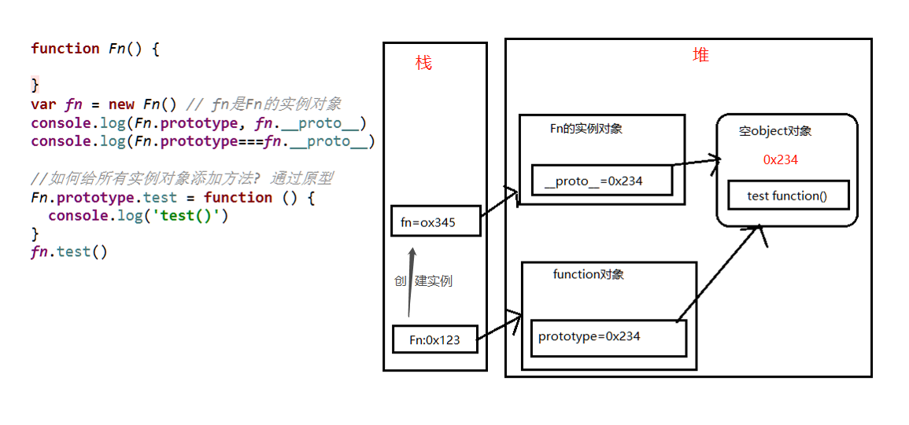 
>
>5. 总结:
> * 函数的[`prototype`]属性: 在定义函数时自动添加的, 默认值是一个空Object实例对象
>
> * 对象的[`__ proto __`]属性: 创建对象时自动添加的, `默认值为构造函数的prototype属性值`
>
> * 程序员能直接操作显式原型, 但不能直接操作隐式原型(ES6之前)
>
> * 函数的显示原型指向的对象默认是空Object的实例对象(但Object不满足此条件，Object指向的是null) --> 所有函数的原型对象默认都是Object的实例(Object除外)
>
>   ```
>   console.log(Fn.prototype instanceof Object) //true
>   console.log(Object.prototype instance of Object) //false
>   console.log(Function.prototype instanceof Object)  //true
>   ```
>
> * 所有函数都是Function的实例(包括Function本身)
>
>   ```
>   console.log(Function.__proto__ === Function.prototype)  //true
>   ```
>
> * Object的原型对象是原型链的尽头
>
>   ```
>   console.log(Object.prototype.__proto__) //null
>   ```
>
>   
>
>6. 代码示例:
>
>  ```js
>    //定义构造函数
>    function Fn() {
>     // 内部默认执行语句: this.prototype = {} --> 默认指向空对象
>      }
>    // 1. 每个函数function都有一个prototype，即显式原型属性, 默认指向一个空的Object对象
>    console.log(Fn.prototype)
>    // 2. 每个实例对象都有一个__proto__，可称为隐式原型
>    //创建实例对象
>    var fn = new Fn()  // 内部默认执行语句: this.__proto__ = Fn.prototype
>    console.log(fn.__proto__)
>    // 3. 对象的隐式原型的值为其对应构造函数的显式原型的值
>    console.log(Fn.prototype===fn.__proto__) // true
>    //给原型添加方法
>    Fn.prototype.test = function () {
>      console.log('test()')
>    }
>    //通过实例调用原型的方法
>    fn.test()
>  ```


### Ⅲ-原型链

#### ① *原型链*

>1. 原型链
>  * 访问一个对象的属性时，
>    * 先在自身属性中查找，找到返回
>    * 如果没有, 再沿着[`__ proto __`]这条链向上查找, 找到返回
>    * 如果最终没找到, 返回undefined
>    * 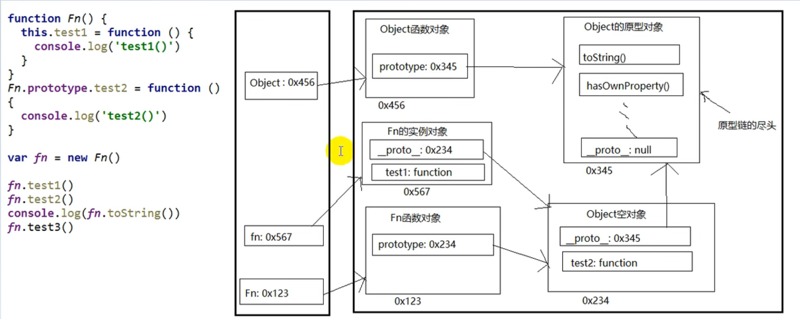
>  * 别名: 隐式原型链
>  * 作用: 查找对象的属性(方法) 

#### ②*构造函数/原型/实例对象的关系(图解)*

>1. ```js
>    var o1 = new Object();
>    var o2 = {};
>
>
>  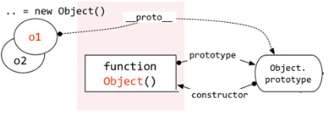 
>
>2. ```js
>    function Foo(){  } 
>    //实际上等于var Foo = new Function(),因此Foo实际上也是Function()的实例对象，有__proto__属性
>    //所有函数(funtion)都有两个属性，__proto__和prototype
>          
>    //特例：只有函数的显示原型属性等于它自身的隐式原型属性(图中的第二个prototype和__proto__指向同一个Function.prototype) --> 相当于Function = new Function() new自己本身 --> 所有函数的prototype都是一样的，都是 new Function()
>          
>    //第三个__proto__指向：Object是Function()的实例对象 --> 原因：任何函数(无论是内置函数还是自定义函数)都是Function的实例对象(new Function()) --> Object也是Object函数
>
> 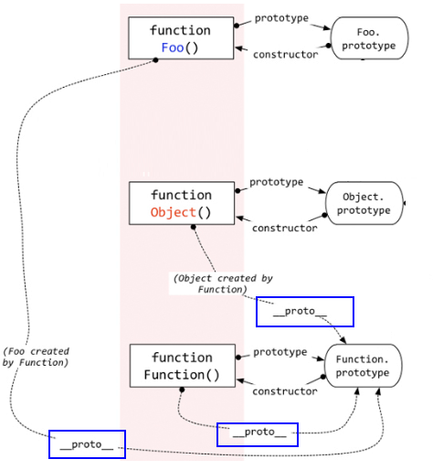 
>
>  ps:所有函数的[`__ proto __`]都是一样的；Function是它自身的实例
>
>

#### ③ *属性问题*

>- 读取对象的属性值时: 会自动到原型链中查找(原型对象上的属性实例对象都是可以获取到的) 
>
>- 设置对象的属性值时: 不会查找原型链, 如果当前对象中没有此属性, 直接添加此属性并设置其值
>
>- 方法一般定义在原型中, 属性一般通过构造函数定义在对象本身上
>
>- 代码示例
>
>  ```js
>    function Fn() { }
>    Fn.prototype.a = 'xxx'
>    var fn1 = new Fn()
>    console.log(fn1.a, fn1) //xxx Fn{} --> 原型链主要是用于查找对象的
>  
>    var fn2 = new Fn()
>    fn2.a = 'yyy'
>    console.log(fn1.a, fn2.a, fn2) //xxx yyy  Fn{a: "yyy"}
>  
>    function Person(name, age) {
>      this.name = name
>      this.age = age
>    }
>    Person.prototype.setName = function (name) {
>      this.name = name
>    }
>    var p1 = new Person('Tom', 12)
>    p1.setName('Bob')
>    console.log(p1)  //Person {name: "Bob", age: 12}
>  
>    var p2 = new Person('Jack', 12)
>    p2.setName('Cat')
>    console.log(p2) //Person {name: "Cat", age: 12}
>    console.log(p1.__proto__===p2.__proto__) // true   -->所以方法一般定义在原型中
>  ```

### Ⅳ-instanceof

>1. instanceof是如何判断的?
>  * 表达式: A instanceof B（A是实例对象，B是构造函数）
>  * 如果B函数的显式原型对象在A对象的原型链上, 返回true, 否则返回false(A只能沿着```__proto__```找;B只能沿着``prototype``找)
>2. Function是通过new自己产生的实例
>
>```js
>  /*
>  案例1
>   */
>  function Foo() {  }
>  var f1 = new Foo()
>  console.log(f1 instanceof Foo) // true
>  console.log(f1 instanceof Object) // true
>
>  /*
>  案例2
>   */
>  console.log(Object instanceof Function) // true
>  console.log(Object instanceof Object) // true
>  console.log(Function instanceof Function) // true
>  console.log(Function instanceof Object) // true
>
>  function Foo() {}
>  console.log(Object instanceof  Foo) // false
>```
>

### Ⅴ-相关面试题

>测试题1:
>
>```js
>  /*
>  测试题1
>   */
>  function A () {}
>  A.prototype.n = 1
>  let b = new A()
>  A.prototype = { n: 2, m: 3}
>  let c = new A()
>  console.log(b.n, b.m, c.n, c.m) // 1 undefined 2 3
>```
>
>测试题2:原理看[②*构造函数/原型/实例对象的关系(图解)*](#②*构造函数/原型/实例对象的关系(图解)*)
>
>```js
>  /*
>   测试题2
>   */
>  function F (){}
>  Object.prototype.a = function(){
>    console.log('a()')
>  }
>  Function.prototype.b = function(){
>    console.log('b()')
>  }
>  
>  let f = new F()
>  f.a() //a()
>  f.b() //f.b is not a function -->找不到
>  F.a() //a()
>  F.b() //b()
>
>  console.log(f)
>  console.log(Object.prototype)
>  console.log(Function.prototype)
>```
>
>结果图例
>
>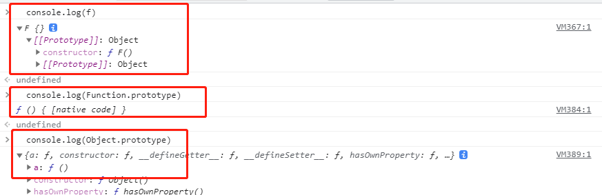


## 2、执行上下文与执行上下文栈

### Ⅰ-变量提升与函数提升

>1. 变量声明提升
>  * 通过var定义(声明)的变量, 在定义语句之前就可以访问到
>  * 值: undefined
>2. 函数声明提升
>  * 通过function声明的函数, 在之前就可以直接调用
>  * 值: 函数定义(对象)
>3. 引出一个问题: 变量提升和函数提升是如何产生的?
>
>```jsx
> /*
>  面试题 : 输出 undefined
>   */
>  var a = 3
>  function fn () {
>    console.log(a)
>    var a = 4 //变量提升
>  }
>  fn()  //undefined
>'--------------------------------------------'
>  console.log(b) //undefined  变量提升
>  fn2() //可调用  函数提升 结果为fn2()
>  // fn3() //不能执行 报错了 实际上没有fn3() 只有fn3变量 可以console.log(fn3) 变量提升
>  var b = 3
>  function fn2() {  console.log('fn2()') }
>  var fn3 = function () { console.log('fn3()') }
>```

### Ⅱ-执行上下文

>1. 代码分类(位置)
>  * 全局代码
>  * 函数(局部)代码
>2. 全局执行上下文
>  * 在执行全局代码前将window确定为全局执行上下文
>  * 对全局数据进行预处理
>    * var定义的全局变量==>undefined, 添加为window的属性
>    * function声明的全局函数==>赋值(fun), 添加为window的方法
>    * this==>赋值(window)
>  * 开始执行全局代码
>3. 函数执行上下文
>  * 在调用函数, 准备执行函数体之前, 创建对应的函数执行上下文对象(虚拟的, 存在于栈中)
>  * 对局部数据进行预处理
>    * 形参变量==>赋值(实参)==>添加为执行上下文的属性
>    * `arguments`==>赋值(实参列表), 添加为执行上下文的属性 -->[不懂的看这里](https://developer.mozilla.org/zh-CN/docs/orphaned/Web/JavaScript/Reference/Functions/arguments)
>    * var定义的局部变量==>undefined, 添加为执行上下文的属性
>    * function声明的函数 ==>赋值(fun), 添加为执行上下文的方法
>    * this==>赋值(调用函数的对象)
>  * 开始执行函数体代码

### Ⅲ-执行上下文栈

>1. 在全局代码执行前, JS引擎就会创建一个栈来存储管理所有的执行上下文对象
>2. 在全局执行上下文(window)确定后, 将其添加到栈中(压栈)-->`所以栈底百分百是[window]`
>3. 在函数执行上下文创建后, 将其添加到栈中(压栈)
>4. 在当前函数执行完后,将栈顶的对象移除(出栈)
>5. 当所有的代码执行完后, 栈中只剩下window
>6. `上下文栈数==函数调用数+1(只是函数调用，不是函数定义)`
>
>```js
>//1. 进入全局执行上下文
>var a = 10
>var bar = function (x) {
>   var b = 5
>   foo(x + b)   //3. 进入foo执行上下文           
> }
> var foo = function (y) {
>   var c = 5
>   console.log(a + c + y)
> }
> bar(10) //2. 进入bar函数执行上下文
>```
>
>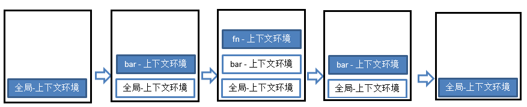
>
>此处用一个动态图来展示:
>
>
>
>举个栗子:  
>
>```js
>//栗子
><!--
>1. 依次输出什么?
> gb: undefined //gb中的i是undefined
> fb: 1  
> fb: 2
> fb: 3
> fe: 3
> fe: 2
> fe: 1
> ge: 1
>2. 整个过程中产生了几个执行上下文?  5
>-->
><script type="text/javascript">
> console.log('gb: '+ i)
> var i = 1
> foo(1)
> function foo(i) {
>   if (i == 4) {
>     return
>   }
>   console.log('fb:' + i)
>   foo(i + 1) //递归调用: 在函数内部调用自己
>   console.log('fe:' + i) //出栈 所以会 3 2 1这样的结果
> }
> console.log('ge: ' + i)
></script>
>```
>
>

### Ⅳ-相关面试题

>`函数提升优先级高于变量提升,且不会被变量声明覆盖,但是会被变量赋值覆盖`
>
>```js
>/*
>测试题1:  先执行变量提升, 再执行函数提升，函数覆盖了变量的值
>
>*/
>function a() {}
>var a
>console.log(typeof a) // 'function' 
>
>
>/*
>测试题2:
>*/
>if (!(b in window)) {
>var b = 1
>}
>console.log(b) // undefined b=1说明执行了里面的代码，b为undefined说明没有执行
>
>/*
>测试题3:
>*/
>var c = 1
>function c(c) {
>console.log(c)
>var c = 3 //与此行无关
>}
>c(2) // 报错  c is not a function
>
>实际上的代码是：
>var c 
>var c
>function c(c) {
>	console.log(c)
>	c=3
>}
>c=2
>c(2)  //实际上c已经不是一个函数，而是一个基础数据类型Number c=2
>```

## 3、作用域与作用域链

### Ⅰ-作用域

>1. 理解
>  * 就是一块"地盘", 一个代码段所在的区域
>  * 它是静态的(相对于上下文对象), 在编写代码时就确定了
>2. 分类
>  * 全局作用域
>  * 函数作用域
>  * 没有块作用域(ES6有了)   -->(java语言也有)
>3. 作用
>  * 隔离变量，不同作用域下同名变量不会有冲突
>
>```js
>/*  //没块作用域
>  if(true) { var c = 3 }
>  console.log(c)
>  */
>  var a = 10,
>    b = 20
>  function fn(x) {
>    var a = 100, c = 300;
>    console.log('fn()', a, b, c, x) //100 20 300 10
>    function bar(x) {
>      var a = 1000, d = 400
>      console.log('bar()', a, b, c, d, x)
>    }
>    bar(100)//1000 20 300 400 100
>    bar(200)//1000 20 300 400 200
>  }
>  fn(10)
>```

### Ⅱ-作用域与执行上下文的区别与联系

>1. 区别1:
> * 全局作用域之外，每个函数都会创建自己的作用域，`作用域在函数定义时就已经确定了。而不是在函数调用时`(个数为n+1个，n为函数定义数)
> * 全局执行上下文环境是在全局作用域确定之后, js代码马上执行之前创建
> * 函数执行上下文是在调用函数时, 函数体代码执行之前创建
>2. 区别2:
> * 作用域是静态的, 只要函数定义好了就一直存在, 且不会再变化
> * 执行上下文是动态的, 调用函数时创建, 函数调用结束时就会自动释放
>3. 联系:
> * 执行上下文(对象)是从属于所在的作用域
> * 全局上下文环境==>全局作用域
> * 函数上下文环境==>对应的函数使用域
>
>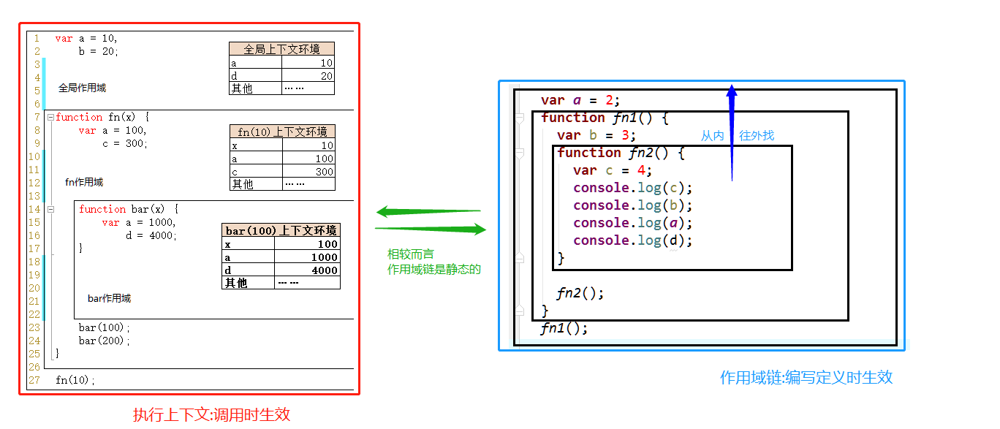

### Ⅲ-作用域链

>1. 理解
>  * 多个上下级关系的作用域形成的链, 它的方向是从下向上的(从内到外)
>  * 查找变量时就是沿着作用域链来查找的
>2. 查找一个变量的查找规则
>  * 在当前作用域下的执行上下文中查找对应的属性, 如果有直接返回, 否则进入2
>  * 在上一级作用域的执行上下文中查找对应的属性, 如果有直接返回, 否则进入3
>  * 再次执行2的相同操作, 直到全局作用域, 如果还找不到就抛出找不到的异常
>
>```js
> var a = 1
>  function fn1() {
>    var b = 2
>    function fn2() {
>      var c = 3
>      console.log(c)
>      console.log(b)
>      console.log(a)
>      console.log(d)  //报错 d is not defined
>    }
>    fn2()
>  }
>  fn1()
>```

### Ⅳ-相关面试题

#### ① `作用域在函数定义时就已经确定了。而不是在函数调用时`

>作用域1:`作用域在函数定义时就已经确定了。而不是在函数调用时`
>
>```js
>  var x = 10;
>  function fn() { console.log(x); }
>  function show(f) {
>    var x = 20;
>    f();
>  }
>  show(fn); //输出10
>```
>
>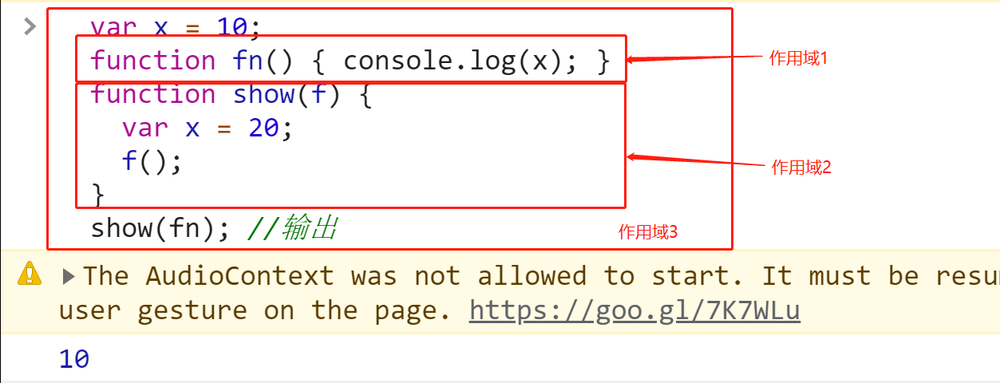

#### ② 对象变量不能产生局部作用域

>```js
>var fn = function () {
>  console.log(fn)
>}
>fn()  //输出fn()函数
>
>var obj = { //对象变量不能产生局部作用域,所以会找到全局去,导致报错
>  fn2: function () {
>   console.log(fn2)  //直接输出fn2是window的fn2,windows上没有fn2
>   //console.log(this.fn2)  //这样子找就可以找到
>  }
>}
>obj.fn2()
>```

## 4、闭包预备知识点梳理

##### `高阶函数是什么?`

>所谓高阶函数，就是一个函数就可以接收另一个函数作为参数，或者是返回一个函数-->常见的高阶函数有map、reduce、filter、sort等
>
>```js
>var ADD =function add(a) {
>return function(b) {
>return a+b
>}
>}
>调用：ADD(2)(3)即可获得结果
>```
>
>1. map
>
>  - ```js
>    //
>    map接受一个函数作为参数，不改变原来的数组，只是返回一个全新的数组
>    var arr = [1,2,3,4,5]
>    var arr1 = arr.map(item => item = 2)
>    //arr  输出[1,2,3,4,5]
>    //arr1 输出[2,2,2,2,2]
>    ```
>
>2. reduce
>
>  - ```js
>    //
>    reduce也是返回一个全新的数组。reduce接受一个函数作为参数，这个函数要有两个形参，代表数组中的前两项，reduce会将这个函数的结果与数组中的第三项再次组成这个函数的两个形参以此类推进行累积操作
>    var arr = [1,2,3,4,5]
>    var arr2 = arr.reduce((a,b)=> a+b)
>    console.log(arr2) // 15
>    ```
>
>3. filter
>
>  - ```js
>    //
>    filter返回过滤后的数组。filter也接收一个函数作为参数，这个函数将作用于数组中的每个元素，根据该函数每次执行后返回的布尔值来保留结果，如果是true就保留，如果是false就过滤掉（这点与map要区分）
>    var arr = [1,2,3,4,5]
>     var arr3 = arr.filter(item => item % 2 == 0)
>    console.log(arr3)// [2,4]
>    ```

## 5、闭包

>一个函数和对其周围状态（**lexical environment，词法环境**）的引用捆绑在一起（或者说函数被引用包围），这样的组合就是**闭包**（**closure**）。也就是说，闭包让你可以在一个内层函数中访问到其外层函数的作用域。在 JavaScript 中，每当创建一个函数，闭包就会在函数创建的同时被创建出来。
>

### Ⅰ-引出闭包概念

#### ① 错误场景

>需求: `点击某个按钮, 提示"点击的是第n个按钮"`
>
>```html
><button>测试1</button>
><button>测试2</button>
><button>测试3</button>
><!--
>需求: 点击某个按钮, 提示"点击的是第n个按钮"
>-->
><script type="text/javascript">
>  var btns = document.getElementsByTagName('button')
>  //注意[btns]不是一个数组,它是一个伪数组
>  //每次获取[btns.length]其实都是需要进行计算的(因为它是伪数组)
>  //所以为了性能更好,在此处赋值,就只需要计算一次
>  for (var i = 0,length=btns.length; i < length; i++) {
>    var btn = btns[i]
>    btn.onclick = function () {  //遍历加监听
>      alert('第'+(i+1)+'个')     //结果 全是[4]
>    }
>  }
></script>    
>```
>
>此处错误是,直接修改并使用全局变量[`i`],导致for循环结束后,所有点击按钮绑定的弹窗值都是[`i+1`]
>
>随后调用时,都会找到[`i`]这个变量,但是此时i==3,所以所有结果都是4
>
>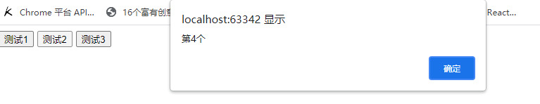 

#### ② 将变量挂载到自身来解决

>解决方式:将btn所对应的下标保存在btn上
>
>```js
><button>测试1</button>
><button>测试2</button>
><button>测试3</button>
><!--
>需求: 点击某个按钮, 提示"点击的是第n个按钮"
>-->
><script type="text/javascript">
>  var btns = document.getElementsByTagName('button')
>  for (var i = 0,length=btns.length; i < length; i++) {
>    var btn = btns[i]
>    //将btn所对应的下标保存在btn上
>    btn.index = i
>    btn.onclick = function () {  //遍历加监听
>      alert('第'+(i+1)+'个')     //结果 全是[4]
>    }
>  }
></script>    
>```
>
>将其放在自己的身上,需要时自己找自己拿,这样就能解决
>
>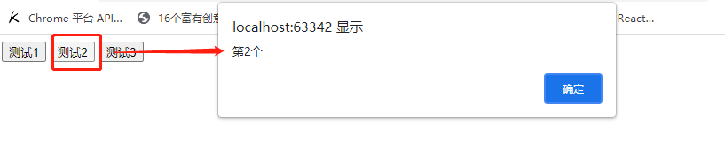

#### ③ 利用闭包
>
>```js
><body>
><button>测试1</button>
><button>测试2</button>
><button>测试3</button>
>
><script type="text/javascript">
>  //利用闭包
>  for (var i = 0,length=btns.length; i < length; i++) {
>     //此处的j是局部的,它将传入的[i]存入局部的[j]中,这样就能实现效果 
>    (function (j) {
>      var btn = btns[j]
>      btn.onclick = function () {
>        alert('第'+(j+1)+'个')
>      }
>    })(i)
>  }
></script>  
></body>
>```
>
>

### Ⅱ-如何产生闭包
 > 当一个嵌套的内部(子)函数引用了嵌套的外部(父)函数的变量(函数)时，就产生了闭包
>
> 闭包的理解：
> 理解一：闭包是嵌套的内部函数
> 理解二：包含被引用变量(函数)的对象
> ps:闭包存在于嵌套的内部函数中
>
> 产生闭包的条件：
> 函数嵌套
> 内部函数引用了外部函数的数据(变量/函数)
> ```js
> function fn1(){
> 	var a = 2
> 	var b = 'abc'
> 	function fn2(){ 
>         //ps:如果是var fn2 = function(){}则不会产生闭包，因为执行函数定义才会产生闭包(不用调用内部函数)
> 	console.log(a)
> 	}
> }
> fn1()
> ```
### Ⅲ-常见的闭包

#### ① 将函数作为另一个函数的返回值

>```js
>// 1. 将函数作为另一个函数的返回值
>  function fn1() {
>    var a = 2
>    function fn2() {
>      a++
>      console.log(a)
>    }
>    return fn2
>  }
>  var f = fn1()
>  f() // 3
>  f() // 4
>```

#### ② 将函数作为实参传递给另一个函数调用

>```js
>// 2. 将函数作为实参传递给另一个函数调用
>  function showDelay(msg, time) {
>    setTimeout(function () {
>      alert(msg)
>    }, time)
>  }
>  showDelay('atguigu', 2000)
>```

#### ③ 高阶函数与柯里化

>有时候闭包在你甚至没有注意到它的时候就会出现，你可能已经看到了我们称为部分应用程序的示例
>
>当然如果你还不理解的话可以,可以完整的多看几次本笔记闭包知识点部分,或者结合上方[ `Ⅱ-举个闭包栗子分析理解` ](#Ⅱ-举个闭包栗子分析理解)进行理解

##### 1、从 ES6 高阶箭头函数理解函数柯里化(`运用到闭包`)

>1. 首先看到了这样的一个例子：
>
>  ```js
>let add = a => b => a + b
>  ```
>
>2. 以上是一个很简单的相加函数，把它转化成 ES5 的写法如下
>
>  ```js
>function add(a) {
>      return function(b) {
>          return a + b
>      }
>  }
>  var add3 = add(3) //add3表示一个指向函数的变量 可以当成函数调用名来用
>  add3(4) === 3 + 4 //true
>  ```
>
>3. 再简化一下，可以写成如下形式：
>
>  ```js
>let add = function(a) {
>    var param = a;
>    var innerFun = function(b) {
>        return param + b;
>    }
>    return innerFun;
>}
>  ```
>
>4. 虽然好像没什么意义，但是很显然上述使用了[`闭包`]，而且该函数的返回值是一个函数。其实，这就是`高阶函数的定义：以函数为参数或者返回值是函数的函数。`
>
>  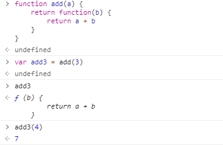

##### 2、柯里化

>1. 图例:
>
>  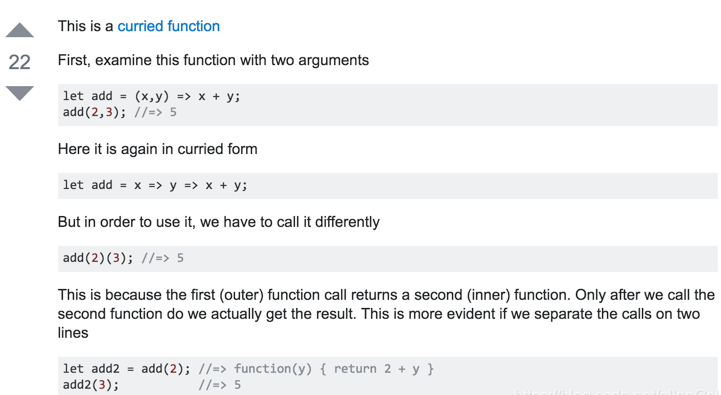
>
>2. 关键就是`理解柯里化`，其实可以把它理解成，柯里化后，`将第一个参数变量存在函数里面了(闭包)`，然后本来需要n个参数的函数可以变成只需要剩下的（n - 1个）参数就可以调用，比如
>
>  ```js
>let add = x => y => x + y
>let add2 = add(2)
>-*----------------------------------
>本来完成 add 这个操作，应该是这样调用
>let add = (x, y) => x + y
>add(2,3)
>----------------------------------
>1. 而现在 add2 函数完成同样操作只需要一个参数，这在函数式编程中广泛应用。
>let add = x => y => x + y
>let add2 = add(2)
>2.详细解释一下，就是 add2 函数 等价于 有了 x 这个闭包变量的 y => x + y 函数,并且此时 x = 2，所以此时调用
>add2(3) === 2 + 3
>  ```

##### 4、总结

>1. 如果是`a => b => c => {xxx}`这种多次柯里化的,如何理解?
>
>  理解:前` n - 1 `次调用，其实是提前将参数传递进去，并没有调用最内层函数体，最后一次调用才会调用最内层函数体，并返回最内层函数体的返回值
>
>2. 结合上文可知，这里的多个连续箭头（无论俩个箭头函数三个及以上）函数连在一起 就是在柯里化。所以连续箭头函数就是多次柯里化函数的 es6 写法。
>
>3. `调用特点`:let test = a => b => c => {xxx}
>
>  比如对于上面的 `test` 函数，它有 3 个箭头， 这个函数要被调用 3 次 `test(a)(b)(c)`，前两次调用只是在传递参数，只有最后依次调用才会返回 `{xxx}` 代码段的返回值，并且在 `{xxx}` 代码段中可以调用 a,b,c

### Ⅳ-闭包的作用

>1. 使用函数内部的变量在函数执行完后, 仍然存活在内存中(延长了局部变量的生命周期)
>2. 让函数外部可以操作(读写)到函数内部的数据(变量/函数)
>
>问题:
>    1. 函数执行完后, 函数内部声明的局部变量是否还存在? 
>         -  一般是不存在, 存在于闭中的变量才可能存在
>    2. 在函数外部能直接访问函数内部的局部变量吗? 
>         - 不能, 但我们可以通过闭包让外部操作它

### Ⅴ-闭包的生命周期

>1. 产生: 在嵌套内部函数定义执行完时就产生了(不是在调用)
>2. 死亡: 在嵌套的内部函数成为垃圾对象时
>   - 即没有人指向它时死亡,通常置为[`null`],当然指向其他也行,但不安全(容易污染变量)
>
>```js
>//闭包的生命周期
>function fn1() {
>    //此时闭包就已经产生了(函数提升,实际上[fn2]提升到了第一行, 内部函数对象已经创建了)
>    var a = 2
>    function fn2 () { //如果时[let fn2=function(){}],那么在这行才会产生闭包
>      a++
>      console.log(a)
>    }
>    return fn2
>  }
>  var f = fn1()
>  f() // 3
>  f() // 4
>  f = null //闭包死亡(包含闭包的函数对象成为垃圾对象)
>```

### Ⅵ-闭包的应用

>闭包的应用 : 定义JS模块
>  * 具有特定功能的js文件
>  * 将所有的数据和功能都封装在一个函数内部(私有的)
>  * 只向外暴露一个包信n个方法的对象或函数
>  * 模块的使用者, 只需要通过模块暴露的对象调用方法来实现对应的功能
>
>1. 模块定义:
>
>   - ```js
>     //myModule.js
>     function myModule() {
>       //私有数据
>       var msg = 'My atguigu'
>       //操作数据的函数
>       function doSomething() {
>         console.log('doSomething() '+msg.toUpperCase())
>       }
>       function doOtherthing () {
>         console.log('doOtherthing() '+msg.toLowerCase())
>       }
>                                                 
>       //向外暴露对象(给外部使用的方法)
>       return {
>         doSomething: doSomething,
>         doOtherthing: doOtherthing
>       }
>     }
>                                                 
>     -----------------------------------------------------------------
>     // myModule2.js   
>     (function () {
>       //私有数据
>       var msg = 'My atguigu'
>       //操作数据的函数
>       function doSomething() {
>         console.log('doSomething() '+msg.toUpperCase())
>       }
>       function doOtherthing () {
>         console.log('doOtherthing() '+msg.toLowerCase())
>       }
>                                                 
>       //向外暴露对象(给外部使用的方法)
>       window.myModule2 = {
>         doSomething: doSomething,
>         doOtherthing: doOtherthing
>       }
>     })()    
>                                                     
>     ```
>
>2. 模块调用
>
>   - ```js
>     //调用示例
>     ------------  模块调用1 --------------------------------------------
>     <script type="text/javascript" src="myModule.js"></script>
>     <script type="text/javascript">
>       var module = myModule()
>       module.doSomething()
>       module.doOtherthing()
>     </script>
>     ------------  模块调用2 --------------------------------------------
>     <script type="text/javascript" src="myModule2.js"></script>
>     <script type="text/javascript">
>       myModule2.doSomething()
>       myModule2.doOtherthing()
>     </script>
>     ```

### Ⅶ-闭包的缺点及解决

>1. 缺点:
>  * 函数执行完后, 函数内的局部变量没有释放, 占用内存时间会变长
>  * 容易造成内存泄露
>2. 解决:
>  * 能不用闭包就不用
>
>  * 及时释放
>
>  * ```js
>    function fn1() {
>      var arr = new Array(100000)
>      function fn2() {
>        console.log(arr.length)
>      }
>      return fn2
>    }
>    var f = fn1()
>    f()
>    f = null //让内部函数成为垃圾对象-->回收闭包
>    ```
>
>我还有一个解决方式,调用时直接`f()()`直接运行调用即可-->匿名函数,用完自动就销毁了
>
>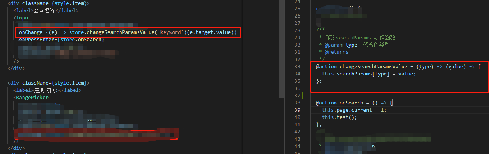

### Ⅷ-内存溢出与内存泄露

>1. 内存溢出
>  * 一种程序运行出现的错误
>  * 当程序运行需要的内存超过了剩余的内存时, 就出抛出内存溢出的错误
>2. 内存泄露
>  * 占用的内存没有及时释放
>  * `内存泄露积累多了就容易导致内存溢出`
>  * 常见的内存泄露:
>    * 意外的全局变量
>    * 没有及时清理的计时器或回调函数
>    * 闭包
>
>```js
><script type="text/javascript">
>  // 1. 内存溢出
>  var obj = {}
>  for (var i = 0; i < 10000; i++) {
>    obj[i] = new Array(10000000)
>    console.log('-----')
>  }
>
>  // 2. 内存泄露
>    // 意外的全局变量
>  function fn() {
>    a = new Array(10000000)  //不使用var let const去承接
>    console.log(a)
>  }
>  fn()
>
>   // 没有及时清理的计时器或回调函数
>  var intervalId = setInterval(function () { //启动循环定时器后不清理
>    console.log('----')
>  }, 1000)
>
>  // clearInterval(intervalId)
>
>    // 闭包
>  function fn1() {
>    var a = 4
>    function fn2() {
>      console.log(++a)
>    }
>    return fn2
>  }
>  var f = fn1()
>  f()
>  // f = null
>
></script>
>```
>
>不使用let const var等去声明,实际上是挂载到[`window`]上的,所以导致内存泄露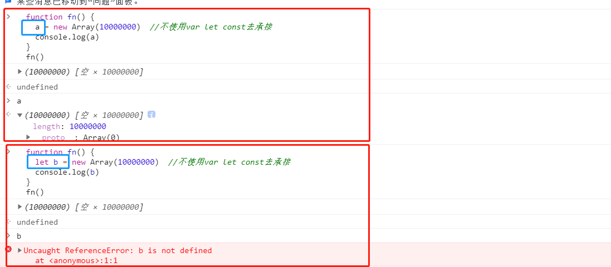

### Ⅸ-相关面试题1

>```js
>//代码片段一  -->没有产生闭包:因为内部函数没有调用外部变量
>var name = "The Window";
>var object = {
>  name : "My Object",
>  getNameFunc : function(){
>    return function(){
>      return this.name;
>    };
>  }
>};
>alert(object.getNameFunc()());  //?  the window
>//函数体的this是window
>
>//代码片段二
>var name2 = "The Window";
>var object2 = {
>  name2 : "My Object",
>  getNameFunc : function(){
>  //此处的this指向是[getNameFunc],他是对象中的属性,所以this指向就是object
>    var that = this;
>    return function(){
>      //此处用的是保存的  that
>      return that.name2;
>    };
>  }
>};
>alert(object2.getNameFunc()()); //?  my object
>```
>
>1. 代码片段一:
>   - 函数体的`this`指向是[`window`]
>   - 没有产生闭包:因为内部函数没有调用外部变量
>2. 代码片段二为何指向是对象?
>   - this指向是调用它的[`getNameFunc`],他是对象中的属性,所以this指向就是object
>   - 产生了闭包

### Ⅹ-相关面试题2

>```js
>function fun(n,o) {
>  console.log(o)
>  return {
>    fun:function(m){
>      return fun(m,n)
>    }
>  }
>}
>var a = fun(0) //undefined
>a.fun(1)  //0
>a.fun(2)  //0	
>a.fun(3)  //0
>
>var b = fun(0).fun(1).fun(2).fun(3) //undefined 0 1 2
>
>var c = fun(0).fun(1) //undefined  0
>c.fun(2)//1 -->经过上方定义后 n固定为1
>c.fun(3)//1 -->此处是陷阱!!!  一直没有改到n,所以一直是1
>```

# 三、面向对象高级

>此部分要求你对前方[函数高级部分的1、原型与原型链](#1、原型与原型链)比较熟悉,如果掌握不够好理解会相对困难

## 1、对象创建模式

### Ⅰ-Object构造函数模式

>方式一: Object构造函数模式
>  * 套路: 先创建空Object对象, 再动态添加属性/方法
>  * 适用场景: 起始时不确定对象内部数据
>  * 问题: 语句太多
>
>```js
>/*一个人: name:"Tom", age: 12*/
>// 先创建空Object对象
>  var p = new Object()
>  p = {} //此时内部数据是不确定的
>  // 再动态添加属性/方法
>  p.name = 'Tom'
>  p.age = 12
>  p.setName = function (name) {
>    this.name = name
>  }
>
>  //测试
>  console.log(p.name, p.age)
>  p.setName('Bob')
>  console.log(p.name, p.age)
>```

### Ⅱ-对象字面量模式

>方式二: 对象字面量模式
>  * 套路: 使用{}创建对象, 同时指定属性/方法
>  * 适用场景: 起始时对象内部数据是确定的
>  * 问题: 如果创建多个对象, 有重复代码
>
>```js
>//对象字面量模式
>var p = {
>    name: 'Tom',
>    age: 12,
>    setName: function (name) {
>      this.name = name
>    }
>  }
>  //测试
>  console.log(p.name, p.age)
>  p.setName('JACK')
>  console.log(p.name, p.age)
>
>  var p2 = {  //如果创建多个对象代码很重复
>    name: 'Bob',
>    age: 13,
>    setName: function (name) {
>      this.name = name
>    }
>  }
>```

### Ⅲ-工厂模式

>方式三: 工厂模式
>  * 套路: 通过工厂函数动态创建对象并返回
>  * 适用场景: 需要创建多个对象
>  * 问题: `对象没有一个具体的类型`, 都是Object类型
>
>```js
>//返回一个对象的函数===>工厂函数
>function createPerson(name, age) { 
>  var obj = {
>    name: name,
>    age: age,
>    setName: function (name) {
>      this.name = name
>    }
>  }
>  return obj
>}
>
>// 创建2个人
>var p1 = createPerson('Tom', 12)
>var p2 = createPerson('Bob', 13)
>
>// p1/p2是Object类型
>
>function createStudent(name, price) {
>  var obj = {
>    name: name,
>    price: price
>  }
>  return obj
>}
>var s = createStudent('张三', 12000)
>// s也是Object
>```

### Ⅳ-自定义构造函数模式

>方式四: 自定义构造函数模式
>  * 套路: 自定义构造函数, 通过new创建对象
>  * 适用场景: 需要创建多个`类型确定`的对象,与上方工厂模式有所对比
>  * 问题: 每个对象都有相同的数据, 浪费内存
>
>```js
>//定义类型
>function Person(name, age) {
>  this.name = name
>  this.age = age
>  this.setName = function (name) {
>    this.name = name
>  }
>}
>var p1 = new Person('Tom', 12)
>p1.setName('Jack')
>console.log(p1.name, p1.age)
>console.log(p1 instanceof Person)
>
>function Student (name, price) {
>  this.name = name
>  this.price = price
>}
>var s = new Student('Bob', 13000)
>console.log(s instanceof Student)
>
>var p2 = new Person('JACK', 23)
>console.log(p1, p2)
>```

### Ⅴ-构造函数+原型的组合模式

>方式六: 构造函数+原型的组合模式-->`最好用这个写法`
>  * 套路: 自定义构造函数, 属性在函数中初始化, 方法添加到原型上
>  * 适用场景: 需要`创建多个类型确定`的对象
>  * 放在原型上可以节省空间(只需要加载一遍方法)
>
>```js
>//在构造函数中只初始化一般函数
>function Person(name, age) { 
>  this.name = name
>  this.age = age
>}
>Person.prototype.setName = function (name) {
>  this.name = name
>}
>
>var p1 = new Person('Tom', 23)
>var p2 = new Person('Jack', 24)
>console.log(p1, p2)
>```

## 2、继承模式

### Ⅰ-原型链继承

>方式1: 原型链继承
>
>      1. 套路
>         - 定义父类型构造函数
>         - 给父类型的原型添加方法
>         - 定义子类型的构造函数
>         - 创建父类型的对象赋值给子类型的原型
>         - `将子类型原型的构造属性设置为子类型`-->此处有疑惑的可以看本笔记[函数高级部分的1、原型与原型链](#1、原型与原型链)
>         - 给子类型原型添加方法
>         - 创建子类型的对象: 可以调用父类型的方法
>      2. 关键
>         - `子类型的原型为父类型的一个实例对象`
>
>```js
>//父类型
>function Supper() {
> this.supProp = '父亲的原型链'
>}
>//给父类型的原型上增加一个[showSupperProp]方法,打印自身subProp
>Supper.prototype.showSupperProp = function () {
> console.log(this.supProp)
>}
>
>//子类型
>function Sub() {
> this.subProp = '儿子的原型链'
>}
>
>// 子类型的原型为父类型的一个实例对象
>Sub.prototype = new Supper()
>// 让子类型的原型的constructor指向子类型
>// 如果不加,其构造函数找的[`new Supper()`]时从顶层Object继承来的构造函数,指向[`Supper()`]
>Sub.prototype.constructor = Sub
>//给子类型的原型上增加一个[showSubProp]方法,打印自身subProp
>Sub.prototype.showSubProp = function () {
> console.log(this.subProp)
>}
>
>var sub = new Sub()
>
>sub.showSupperProp() //父亲的原型链
>sub.showSubProp() //儿子的原型链
>console.log(sub)  
>/**
>Sub {subProp: "儿子的原型链"}
>subProp: "儿子的原型链"
>__proto__: Supper
>constructor: ƒ Sub()
>showSubProp: ƒ ()
>supProp: "父亲的原型链"
>__proto__: Object
>*/
>```

#### ① 示例图

>`注意`:此图中没有体现[`constructor构造函数 `],会在下方构造函数补充处指出
>
>

#### ② 构造函数补充

>对于代码中[`Sub.prototype.constructor = Sub`]是否有疑惑?
>
>如果不加,其构造函数找的[`new Supper()`]是从顶层Object继承来的构造函数,指向[`Supper()`],虽然如果你不加这句话,大体上使用是不受影响的,但是你有一个属性指向是错误的,如果在大型项目中万一万一哪里再调用到了呢?
>
>1. 这里可以补充一下constructor 的概念：
>   - `constructor 我们称为构造函数，因为它指回构造函数本身`
>   - 其作用是让某个构造函数产生的 所有实例对象（比如f） 能够找到他的构造函数（比如Fun），用法就是f.constructor
>2. 此时实例对象里没有constructor 这个属性，于是沿着原型链往上找到Fun.prototype 里的constructor，并指向Fun 函数本身
>   - constructor本就存在于原型中,指向构造函数,成为子对象后，如果该原型链中的constructor在自身没有而是在父原型中找到,所以指向父类的构造函数
>3. 由于这里的继承是直接改了构造函数的prototype 的指向，所以在 sub的原型链中，Sub.prototype 没有constructor 属性，反而是看到了一个super 实例
>4. 这就让sub 实例的constructor 无法使用了。为了他还能用，就在那个super 实例中手动加了一个constructor 属性，且指向Sub 函数看到了一个super 实例

### Ⅱ-借用构造函数继承(假的)

>方式2: 借用构造函数继承(假的)
>
>1. 套路:
>     - 定义父类型构造函数
>     - 定义子类型构造函数
>     - 在子类型构造函数中调用父类型构造
>2. 关键:
>     - `在子类型构造函数中通用call()调用父类型构造函数`
>3. 作用:
>   - 能借用父类中的构造方法,但是不灵活
>
>```js
>function Person(name, age) {
>  this.name = name
>  this.age = age
>}
>function Student(name, age, price) {
>   //此处利用call(),将 [Student]的this传递给Person构造函数
>  Person.call(this, name, age)  // 相当于: this.Person(name, age)
>  /*this.name = name
>  this.age = age*/
>  this.price = price
>}
>
>var s = new Student('Tom', 20, 14000)
>console.log(s.name, s.age, s.price)
>```
>
>[`Person`]中的this是动态变化的,在[`Student`]中利用[`Person.call(this, name, age)`]改变了其this指向,所以可以实现此效果

### Ⅲ-组合继承

>方式3: 原型链+借用构造函数的组合继承
>
>1. 利用原型链实现对父类型对象的方法继承
>2. 利用super()借用父类型构建函数初始化相同属性
>
>```js
>function Person(name, age) {
>  this.name = name
>  this.age = age
>}
>Person.prototype.setName = function (name) {
>  this.name = name
>}
>
>function Student(name, age, price) {
>  Person.call(this, name, age)  // 为了得到属性
>  this.price = price
>}
>Student.prototype = new Person() // 为了能看到父类型的方法
>Student.prototype.constructor = Student //修正constructor属性
>Student.prototype.setPrice = function (price) {
>  this.price = price
>}
>
>var s = new Student('Tom', 24, 15000)
>s.setName('Bob')
>s.setPrice(16000)
>console.log(s.name, s.age, s.price)
>```

# 三、线程机制与事件机制

## 1、进程与线程

>   

### Ⅰ- 进程

>1. 程序的一次执行,它`占有一片独有的内存空间`
>2. 可以通过windows任务管理器查看进程
>   - 可以看出每个程序的内存空间是相互独立的
>   -  

### Ⅱ-线程

>概念:
>
>- 是进程内的一个独立执行单元
>- 是程序执行的一个完整流程
>- 是CPU的最小的调度单元

### Ⅲ-进程与线程

>1. 应用程序必须运行在某个进程的某个线程上
>2. 一个进程中至少有一个运行的线程:主线程                 -->进程启动后自动创建
>3. 一个进程中也可以同时运行多个线程:此时我们会说这个程序是多线程运行的
>4. 多个进程之间的数据是不能直接共享的                    -->内存相互独立(隔离)
>5. `线程池(thread pool)`:保存多个线程对象的容器,实现线程对象的反复利用

### Ⅳ-引出的问题

#### ① 何为多进程与多线程?

>多进程运行: 一应用程序可以同时启动多个实例运行
>
>多线程: 在一个进程内, 同时有多个线程运行

#### ②比较单线程与多线程?

>多线程:
>
>- 优点:能有效提升CPU的利用率
>- 缺点
>  - 创建多线程开销
>  - 线程间切换开销
>  - 死锁与状态同步问题
>
>单线程:
>
>* 优点:顺序编程简单易懂
>* 缺点:效率低

#### ③ JS是单线程还是多线程?

>`JS是单线程运行的 , 但使用H5中的 Web Workers可以多线程运行`
>
>* 只能由一个线程去操作DOM界面
>* 具体原因可看下方[3、JS是单线程的](#3、JS是单线程的)部分给出的详解

#### ④ 浏览器运行是单线程还是多线程?

>都是多线程运行的

#### ⑤ 浏览器运行是单进程还是多进程?

>有的是单进程:
>
>* firefox
>* 老版IE
>
>有的是多进程:
>
>* chrome
>* 新版IE
>
>如何查看浏览器是否是多进程运行的呢? 任务管理器-->进程

## 2、浏览器内核

>支撑浏览器运行的最核心的程序

### Ⅰ-不同浏览器的内核

>- Chrome, Safari : webkit
>- firefox : Gecko
>- IE	: Trident
>- 360,搜狗等国内浏览器: Trident + webkit

### Ⅱ-内核由什么模块组成?

>主线程
>
>1. js引擎模块 : 负责js程序的编译与运行
>2. html,css文档解析模块 : 负责页面文本的解析(拆解)
>3. dom/css模块 : 负责dom/css在内存中的相关处理
>4. 布局和渲染模块 : 负责页面的布局和效果的绘制
>5. 布局和渲染模块 : 负责页面的布局和效果的绘制
>
>分线程
>
>- 定时器模块 : 负责定时器的管理
>- 网络请求模块 : 负责服务器请求(常规/Ajax)
>- 事件响应模块 : 负责事件的管理
>
>图例
>
>

## 3、定时器引发的思考

>```js
><body>
><button id="btn">启动定时器</button>
><script type="text/javascript">
>  document.getElementById('btn').onclick = function () {
>    var start = Date.now()
>    console.log('启动定时器前...')
>    setTimeout(function () {
>      console.log('定时器执行了', Date.now()-start) //定时器并不能保证真正定时执行,一般会延迟一丁点
>    }, 200)
>    console.log('启动定时器后...')
>    // 做一个长时间的工作
>    for (var i = 0; i < 1000000000; i++) { //会造成定时器延长很长时间
>        ...
>    }
>  }
></script>
></body>
>```

### Ⅰ-定时器真是定时执行的吗?

>* 定时器并不能保证真正定时执行
>* 一般会延迟一丁点(可以接受), 也有可能延迟很长时间(不能接受)

### Ⅱ-定时器回调函数是在分线程执行的吗?

>在主线程执行的, JS是单线程的

### Ⅲ-定时器是如何实现的?

> `事件循环模型`,在下方给出详解

## 3、JS是单线程的

### Ⅰ-如何证明JS执行是单线程的

>* `setTimeout()的回调函数是在主线程执行的`
>* 定时器回调函数只有在运行栈中的代码全部执行完后才有可能执行
>
>```js
>// 如何证明JS执行是单线程的
> setTimeout(function () { //4. 在将[timeout 1111]弹窗关闭后,再等一秒 执行此处
>    console.log('timeout 2222')
>    alert('22222222')
>  }, 2000)
>  setTimeout(function () { //3. 过了一秒后 打印 timeout 1111并弹窗,此处如果不将弹窗关闭,不会继续执行上方222
>    console.log('timeout 1111')
>    alert('1111111')
>  }, 1000)
>  setTimeout(function () { //2. 然后打印timeout() 00000
>    console.log('timeout() 00000')
>  }, 0)
>  function fn() { //1. fn()
>    console.log('fn()')
>  }
>  fn()
>//----------------------
>  console.log('alert()之前')
>  alert('------') //暂停当前主线程的执行, 同时暂停计时, 点击确定后, 恢复程序执行和计时
>  console.log('alert()之后')
>```
>
>流程结果:
>
>1. 先打印了[`fn()`],然后马上就打印了[`timeout() 00000`]
>2. 过了一秒后 打印 timeout 1111并弹窗,此处如果不将弹窗关闭,不会继续执行上方222
>3. 在将[timeout 1111]弹窗关闭后,`再等一秒` 执行此处
>   - 问:为何明明写的是2秒,却关闭上一个弹窗再过一秒就执行?
>   - 解:并不是关闭后再计算的,而是一起计算的,alert只是暂停了主线程执行

### Ⅱ-JS引擎执行代码的基本流程与代码分类

>代码分类:
>
>- 初始化代码
>- 回调代码
>
>js引擎执行代码的基本流程
>
>1. 先执行初始化代码: 包含一些特别的代码   回调函数(异步执行)
>  * 设置定时器
>  * 绑定事件监听
>  * 发送ajax请求
>2. 后面在某个时刻才会执行回调代码

### Ⅲ-为什么js要用单线程模式, 而不用多线程模式?

>  1. JavaScript的单线程，与它的用途有关。
>  2. 作为浏览器脚本语言，JavaScript的主要用途是与用户互动，以及操作DOM。
>  3. 这决定了它只能是单线程，否则会带来很复杂的同步问题
>       * 举个栗子:如果我们要实现更新页面上一个dom节点然后删除,用单线程是没问题的
>       * 但是如果多线程,当我删除线程先删除了dom节点,更新线程要去更新的时候就会出错

## 4、事件循环模型(Event Loop)机制

### Ⅰ-概念引出

>我们都知道，`javascript从诞生之日起就是一门单线程的非阻塞的脚本语言`。这是由其最初的用途来决定的：`与浏览器交互`。
>
>单线程意味着，javascript代码在执行的任何时候，都只有一个主线程来处理所有的任务。
>
>`非阻塞`:
>
>>而非阻塞则是当代码需要进行一项异步任务（无法立刻返回结果，需要花一定时间才能返回的任务，如I/O事件）的时候，主线程会挂起（pending）这个任务，然后在异步任务返回结果的时候再根据一定规则去执行相应的回调。
>
>`单线程是必要的`:
>
>>也是javascript这门语言的基石，原因之一在其最初也是最主要的执行环境——浏览器中，我们需要进行各种各样的dom操作。试想一下 如果javascript是多线程的，那么当两个线程同时对dom进行一项操作，例如一个向其添加事件，而另一个删除了这个dom，此时该如何处理呢？因此，为了保证不会 发生类似于这个例子中的情景，javascript选择只用一个主线程来执行代码，这样就保证了程序执行的一致性。
>
>当然，现如今人们也意识到，单线程在保证了执行顺序的同时也限制了javascript的效率，因此开发出了`web workers`技术。这项技术号称可以让javaScript成为一门多线程语言。
>
>>然而，使用web workers技术开的多线程有着诸多限制，例如：`所有新线程都受主线程的完全控制，不能独立执行`。这意味着这些“线程” 实际上应属于主线程的子线程。另外，这些子线程并没有执行I/O操作的权限，只能为主线程分担一些诸如计算等任务。所以严格来讲这些线程并没有完整的功能，也因此这项技术并非改变了javascript语言的单线程本质。
>
>可以预见，未来的javascript也会一直是一门单线程的语言。
>
>话说回来，前面提到javascript的另一个特点是“`非阻塞`”，那么javascript引擎到底是如何实现的这一点呢？
>
>>答案就是——event loop（事件循环）。
>
>**注：`虽然nodejs中的也存在与传统浏览器环境下的相似的事件循环。然而两者间却有着诸多不同，故把两者分开，单独解释`。**

### Ⅱ-浏览器环境下JS引擎的事件循环机制

#### ① 执行栈概念

>执行上下文栈详情可以看上方笔记 -->[函数高级的2、执行上下文与执行上下文栈](#2、执行上下文与执行上下文栈),此处继续进行一次概述加深理解
>
>当javascript代码执行的时候会将不同的变量存于内存中的不同位置：`堆（heap）`和`栈（stack）`中来加以区分。其中，堆里存放着一些对象。而栈中则存放着一些基础类型变量以及对象的指针。 `但是我们这里说的执行栈和上面这个栈的意义却有些不同`。
>
>`执行栈`:
>
>> 当我们调用一个方法的时候，js会生成一个与这个方法对应的执行环境（context），又叫`执行上下文`。这个执行环境中存在着这个方法的私有作用域、上层作用域的指向、方法的参数，这个作用域中定义的变量以及这个作用域的this对象。 而当一系列方法被依次调用的时候，因为js是单线程的，同一时间只能执行一个方法，于是这些方法被排队在一个单独的地方。这个地方被称为执行栈。
>
>当一个脚本第一次执行的时候，js引擎会解析这段代码，并将其中的同步代码按照执行顺序加入执行栈中，然后从头开始执行。如果当前执行的是一个方法，那么js会向执行栈中添加这个方法的执行环境，然后进入这个执行环境继续执行其中的代码。`当这个执行环境中的代码 执行完毕并返回结果后，js会退出这个执行环境并把这个执行环境销毁，回到上一个方法的执行环境`。这个过程反复进行，直到执行栈中的代码全部执行完毕。
>
>此处继续拿出栈图加深理解: 
>
>从图片可知，一个方法执行会向执行栈中加入这个方法的执行环境，在这个执行环境中还可以调用其他方法，甚至是自己，其结果不过是在执行栈中再添加一个执行环境。这个过程可以是无限进行下去的，`除非发生了栈溢出，即超过了所能使用内存的最大值`。
>
>以上的过程说的都是同步代码的执行。那么当一个异步代码（如发送ajax请求数据）执行后会如何呢？
>
>> 刚刚说过js的另一大特点是非阻塞，实现这一点的关键在于下面要说的这项机制——`事件队列（Task Queue）`。

#### ② 事件队列（Task Queue）

>JS引擎遇到一个异步事件后并不会一直等待其返回结果，而是会将这个事件挂起，继续执行执行栈中的其他任务,当一个异步事件返回结果后，js会将这个事件加入与当前执行栈不同的另一个队列，我们称之为`事件队列`。
>
>> 被放入事件队列不会立刻执行其回调，而是`等待当前执行栈中的所有任务都执行完毕， 主线程处于闲置状态时，主线程会去查找事件队列是否有任务`。如果有，那么主线程会从中取出排在第一位的事件，并把这个事件对应的回调放入执行栈中，然后执行其中的同步代码...，如此反复，`这样就形成了一个无限的循环。这就是这个过程被称为“事件循环（Event Loop）”的原因。`
>
>这里还有一张图来展示这个过程: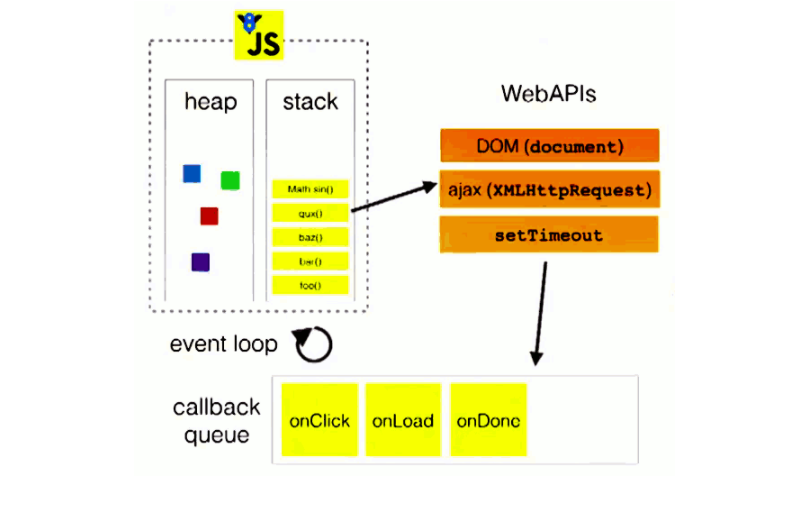
>
>图中的stack表示我们所说的执行栈，web apis则是代表一些异步事件，而callback queue即事件队列。
>
>以上的事件循环过程是一个宏观的表述，实际上因为异步任务之间并不相同，因此他们的执行优先级也有区别。`不同的异步任务被分为两类：微任务（micro task）和宏任务（macro task）`,此部分看下方详解

### Ⅲ-宏任务(**macro task**)与微任务(**micro task**)

> 宏任务与微任务亦属于[Ⅱ-浏览器环境下JS引擎的事件循环机制](#Ⅱ-浏览器环境下JS引擎的事件循环机制)内知识点,但本人觉得比较重要,将其提高至其知识点

#### ① 宏任务队列与微任务队列解释

>顾名思义,宏任务放至宏任务队列(`简称宏队列`)中、微任务放至微任务队列(`简称微队列`)中
>
>1. JS中用来存储待执行回调函数的队列包含2个不同特定的列队
>   - `宏队列`:用来保存待执行的宏任务(回调),比如:`定时器`回调/ajax回调/dom事件回调
>   - `微队列`:用来保存待执行的微任务(回调),比如:`Promise`的回调/muntation回调
>2. JS执行时会区别这2个队列:
>     - JS执行引擎首先必须执行所有的`初始化同步任务`代码
>     - 每次准备取出第一个`宏任务执行前`,都要将所有的`微任务`一个一个取出来执行
>
>前面我们介绍过，在一个事件循环中，异步事件返回结果后会被放到一个任务队列中。然而，根据这个异步事件的类型，这个事件实际上会被对应的宏任务队列或者微任务队列中去。并且在当前执行栈为空的时候，主线程会 查看微任务队列是否有事件存在。如果不存在，那么再去宏任务队列中取出一个事件并把对应的回到加入当前执行栈；如果存在，则会依次执行队列中事件对应的回调，直到微任务队列为空，然后去宏任务队列中取出最前面的一个事件，把对应的回调加入当前执行栈...如此反复，进入循环。
>
>我们只需记住:** `当前执行栈执行完毕时会立刻先处理所有微任务队列中的事件，然后再去宏任务队列中取出一个事件。同一次事件循环中，微任务永远在宏任务之前执行` **

#### ② 原理图

> 
>


#### ③ 由代码逆向理解宏任务与微任务

> 代码示例
>
> ```js
> setTimeout(() => { 
>       console.log('timeout callback1（）')//立即放入宏队列
>       Promise.resolve(3).then(
>         value => { 
>           console.log('Promise onResolved3()', value)//当这个宏任务执行后 立马放入微队列,所以这个微任务执行完后下个宏任务才能执行 
>         }
>       )
>     }, 0)
> 
>     setTimeout(() => { 
>       console.log('timeout callback2（）') //立即放入宏队列,
>     }, 0)
> 
>     Promise.resolve(1).then(
>       value => { 
>         console.log('Promise onResolved1()', value)//立即放入微队列
>         setTimeout(() => {
>           console.log('timeout callback3（）', value) //立即放入宏任务
>         }, 0)
>       }
>     )
> 
>     Promise.resolve(2).then(
>       value => { 
>         console.log('Promise onResolved2()', value)//立即放入微队列
>       }
>     )
> console.log('同步代码') //同步代码立即执行
> ```
>
> 结果
>
> ```js
>  '同步代码',
>   'Promise onResolved1()',
>   'Promise onResolved2()',
>   'timeout callback1（）',
>   'Promise onResolved3()',
>   'timeout callback2（）',
>   'timeout callback3（）'
> ```

### Ⅳ-**node环境下的事件循环机制**

>`不学node的小伙伴就跳过此部分直接去下一节Web Workers笔记吧`

#### ① **与浏览器环境有何不同?**

>在node中，事件循环表现出的状态与浏览器中大致相同。不同的是node中有一套自己的模型。node中事件循环的实现是依靠的libuv引擎。我们知道node选择chrome v8引擎作为js解释器，v8引擎将js代码分析后去调用对应的node api，而这些api最后则由libuv引擎驱动，执行对应的任务，并把不同的事件放在不同的队列中等待主线程执行。 `因此实际上node中的事件循环存在于libuv引擎中`。

#### ② **事件循环模型**

>下面是一个libuv引擎中的事件循环的模型:
>
>```js
>//libuv引擎中的事件循环的模型
>┌───────────────────────┐
>┌─>│        timers         │
>│  └──────────┬────────────┘
>│  ┌──────────┴────────────┐
>│  │     I/O callbacks     │
>│  └──────────┬────────────┘
>│  ┌──────────┴────────────┐
>│  │     idle, prepare     │
>│  └──────────┬────────────┘      ┌───────────────┐
>│  ┌──────────┴────────────┐      │   incoming:   │
>│  │         poll          │<──connections───     │
>│  └──────────┬────────────┘      │   data, etc.  │
>│  ┌──────────┴────────────┐      └───────────────┘
>│  │        check          │
>│  └──────────┬────────────┘
>│  ┌──────────┴────────────┐
>└──┤    close callbacks    │
>   └───────────────────────┘
>```
>
>*注：模型中的每一个方块代表事件循环的一个阶段*
>
>这个模型是node官网上的一篇文章中给出的，我下面的解释也都来源于这篇文章。我会在文末把文章地址贴出来，有兴趣的朋友可以亲自与看看原文。

#### ③ **事件循环各阶段详解**

>从上面这个模型中，我们可以大致分析出node中的事件循环的顺序：
>
>> 外部输入数据-->轮询阶段(poll)-->检查阶段(check)-->关闭事件回调阶段(close callback)-->定时器检测阶段(timer)-->I/O事件回调阶段(I/O callbacks)-->闲置阶段(idle, prepare)-->轮询阶段...
>
>这些阶段大致的功能如下：
>
>- timers(定时器检测阶段): 这个阶段执行定时器队列中的回调如 `setTimeout()` 和 `setInterval()`。
>- I/O callbacks(I/O事件回调阶段): 这个阶段执行几乎所有的回调。但是不包括close事件，定时器和`setImmediate()`的回调。
>- idle, prepare: 这个阶段仅在内部使用，可以不必理会。
>- poll(轮询阶段): 等待新的I/O事件，node在一些特殊情况下会阻塞在这里。
>- check(检查阶段): `setImmediate()`的回调会在这个阶段执行。
>- close callbacks(关闭事件回调阶段): 例如`socket.on('close', ...)`这种close事件的回调。
>
>下面我们来按照代码第一次进入libuv引擎后的顺序来详细解说这些阶段：

##### **poll(轮询阶段)**

>当个v8引擎将js代码解析后传入libuv引擎后，循环首先进入poll阶段。poll阶段的执行逻辑如下： 先查看poll queue中是否有事件，有任务就按先进先出的顺序依次执行回调。 当queue为空时，会检查是否有setImmediate()的callback，如果有就进入check阶段执行这些callback。但同时也会检查是否有到期的timer，如果有，就把这些到期的timer的callback按照调用顺序放到timer queue中，之后循环会进入timer阶段执行queue中的 callback。 这两者的顺序是不固定的，收到代码运行的环境的影响。如果两者的queue都是空的，那么loop会在poll阶段停留，直到有一个i/o事件返回，循环会进入i/o callback阶段并立即执行这个事件的callback。
>
>值得注意的是，poll阶段在执行poll queue中的回调时实际上不会无限的执行下去。`有两种情况poll阶段会终止执行poll queue中的下一个回调：1.所有回调执行完毕。2.执行数超过了node的限制。`

##### check(检查阶段)

>check阶段专门用来执行`setImmediate()`方法的回调，当poll阶段进入空闲状态，并且setImmediate queue中有callback时，事件循环进入这个阶段。

##### close callbacks(关闭事件回调阶段)

>当一个socket连接或者一个handle被突然关闭时（例如调用了`socket.destroy()`方法），close事件会被发送到这个阶段执行回调。否则事件会用`process.nextTick（）`方法发送出去。

##### timers(定时器检测阶段)

>这个阶段以先进先出的方式执行所有到期的timer加入timer队列里的callback，一个timer callback指得是一个通过setTimeout或者setInterval函数设置的回调函数。

##### I/O callbacks(I/O事件回调阶段)

>如上文所言，这个阶段主要执行大部分I/O事件的回调，包括一些为操作系统执行的回调。例如一个TCP连接生错误时，系统需要执行回调来获得这个错误的报告。

#### ④ **process.nextTick,setTimeout与setImmediate的区别与使用场景**

>在node中有三个常用的用来推迟任务执行的方法：process.nextTick,setTimeout（setInterval与之相同）与setImmediate

这三者间存在着一些非常不同的区别：

##### **process.nextTick()**

>尽管没有提及，但是实际上node中存在着一个特殊的队列，即nextTick queue。这个队列中的回调执行虽然没有被表示为一个阶段，当时这些事件却会在每一个阶段执行完毕准备进入下一个阶段时优先执行。当事件循环准备进入下一个阶段之前，会先检查nextTick queue中是否有任务，如果有，那么会先清空这个队列。与执行poll queue中的任务不同的是，这个操作在队列清空前是不会停止的。这也就意味着，错误的使用`process.nextTick()`方法会导致node进入一个死循环。。直到内存泄漏。
>
>使用这个方法比较合适呢？下面有一个例子：
>
>```js
>const server = net.createServer(() => {}).listen(8080);
>server.on('listening', () => {});
>```
>
>这个例子中当，当listen方法被调用时，除非端口被占用，否则会立刻绑定在对应的端口上。这意味着此时这个端口可以立刻触发listening事件并执行其回调。然而，这时候`on('listening)`还没有将callback设置好，自然没有callback可以执行。为了避免出现这种情况，node会在listen事件中使用`process.nextTick()`方法，确保事件在回调函数绑定后被触发。

##### **setTimeout()和setImmediate()**

>在三个方法中，这两个方法最容易被弄混。实际上，某些情况下这两个方法的表现也非常相似。然而实际上，这两个方法的意义却大为不同。
>
>`setTimeout()`方法是定义一个回调，并且希望这个回调在我们所指定的时间间隔后第一时间去执行。注意这个“第一时间执行”，这意味着，受到操作系统和当前执行任务的诸多影响，该回调并不会在我们预期的时间间隔后精准的执行。执行的时间存在一定的延迟和误差，这是不可避免的。node会在可以执行timer回调的第一时间去执行你所设定的任务。
>
>`setImmediate()`方法从意义上将是立刻执行的意思，但是实际上它却是在一个固定的阶段才会执行回调，即poll阶段之后。有趣的是，这个名字的意义和之前提到过的`process.nextTick()`方法才是最匹配的。node的开发者们也清楚这两个方法的命名上存在一定的混淆，他们表示不会把这两个方法的名字调换过来---因为有大量的node程序使用着这两个方法，调换命名所带来的好处与它的影响相比不值一提。
>
>`setTimeout()`和不设置时间间隔的`setImmediate()`表现上及其相似。猜猜下面这段代码的结果是什么？
>
>```js
>setTimeout(() => {
>    console.log('timeout');
>}, 0);
>
>setImmediate(() => {
>    console.log('immediate');
>});
>```
>
>实际上，答案是不一定。没错，就连node的开发者都无法准确的判断这两者的顺序谁前谁后。这取决于这段代码的运行环境。运行环境中的各种复杂的情况会导致在同步队列里两个方法的顺序随机决定。但是，在一种情况下可以准确判断两个方法回调的执行顺序，那就是在一个I/O事件的回调中。下面这段代码的顺序永远是固定的：
>
>```js
>const fs = require('fs');
>
>fs.readFile(__filename, () => {
>    setTimeout(() => {
>        console.log('timeout');
>    }, 0);
>    setImmediate(() => {
>        console.log('immediate');
>    });
>});
>```
>
>答案永远是：
>
>```js
>immediate
>timeout
>```
>
>因为在I/O事件的回调中，setImmediate方法的回调永远在timer的回调前执行。

## 5、Web Workers

>想了解更多可以点击链接查看更多,此处只是大致了解学习   -->[Web Workers](https://developer.mozilla.org/zh-CN/docs/Web/API/Web_Workers_API/Using_web_workers)
>
>1. H5规范提供了js分线程的实现, 取名为: Web Workers
>2. 相关API
>  * Worker: 构造函数, 加载分线程执行的js文件
>  * Worker.prototype.onmessage: 用于接收另一个线程的回调函数
>  * Worker.prototype.postMessage: 向另一个线程发送消息
>3. 不足
>  * worker内代码不能操作DOM(更新UI)
>  * 不能跨域加载JS
>  * 不是每个浏览器都支持这个新特性

### Ⅰ-抛砖引玉,引出用处

>还是拿斐波那契（Fibonacci）数列来做例子,这东西效率低,可以拿来模拟
>
>```html
><body>
><input type="text" placeholder="数值" id="number">
><button id="btn">计算</button>
><script type="text/javascript">
>  // 1 1 2 3 5 8    f(n) = f(n-1) + f(n-2)
>  function fibonacci(n) {
>    return n<=2 ? 1 : fibonacci(n-1) + fibonacci(n-2)  //递归调用
>  }
>  // console.log(fibonacci(7))
>  var input = document.getElementById('number')
>  document.getElementById('btn').onclick = function () {
>    var number = input.value
>    var result = fibonacci(number)
>    alert(result)
>  }
></script>
>```
>
>当我运行此行代码,传入计算数值为50左右(有的甚至更低),整个页面就会卡住好久的时间不能操作(计算结束后才会弹窗,但是未弹窗的这段时间用户并不能进行操作),这时候就会发现单线程的弊端了

### Ⅱ-尝试使用

>1. H5规范提供了js分线程的实现, 取名为: Web Workers
>2. 相关API
>  * Worker: 构造函数, 加载分线程执行的js文件
>  * Worker.prototype.onmessage: 用于接收另一个线程的回调函数
>  * Worker.prototype.postMessage: 向另一个线程发送消息
>3. 不足
>  * worker内代码不能操作DOM(更新UI)
>  * 不能跨域加载JS
>  * 不是每个浏览器都支持这个新特性

#### ① 主线程

>1. 创建一个Worker对象
>2. 绑定[主线程接收分线程返回的数据]方法
>3. 主线程向分线程发送数据,然后等待接受数据
>4. 接收到分线程回馈的数据,将数据进行处理(如弹窗)
>
>```html
><body>
><input type="text" placeholder="数值" id="number">
><button id="btn">计算</button>
><script type="text/javascript">
>  var input = document.getElementById('number')
>  document.getElementById('btn').onclick = function () {
>    var number = input.value
>
>    //创建一个Worker对象
>    var worker = new Worker('worker.js')
>    // 绑定接收消息的监听
>    worker.onmessage = function (event) { //此处变成回调代码,会在初始化工作完成后才会进行
>      console.log('主线程接收分线程返回的数据: '+event.data)
>      alert(event.data)
>    }
>
>    // 向分线程发送消息
>    worker.postMessage(number)
>    console.log('主线程向分线程发送数据: '+number)
>  }
>  // console.log(this) // window
>
></script>
></body>
>```

#### ② 分线程

>将计算放置分线程中
>
>`注意`:alert(result)  alert是window的方法, 在分线程不能调用,`分线程中的全局对象不再是window`, 所以在分线程中不可能更新界面
>
>```js
>//worker.js
>function fibonacci(n) {
>  return n<=2 ? 1 : fibonacci(n-1) + fibonacci(n-2)  //递归调用
>}
>
>console.log(this)
>this.onmessage = function (event) {
>  var number = event.data
>  console.log('分线程接收到主线程发送的数据: '+number)
>  //计算
>  var result = fibonacci(number)
>  postMessage(result)
>  console.log('分线程向主线程返回数据: '+result)
>  // alert(result)  alert是window的方法, 在分线程不能调用
>  // 分线程中的全局对象不再是window, 所以在分线程中不可能更新界面
>}
>```

### Ⅲ-流程原理图

> 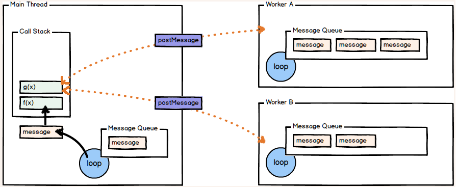


