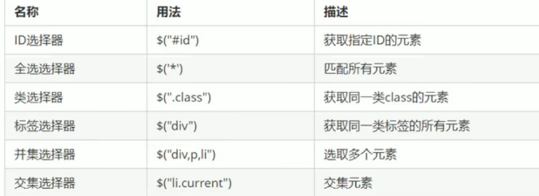
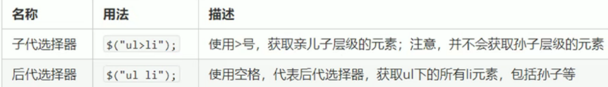
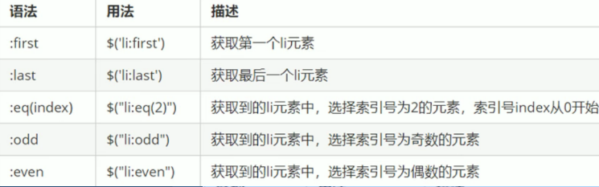
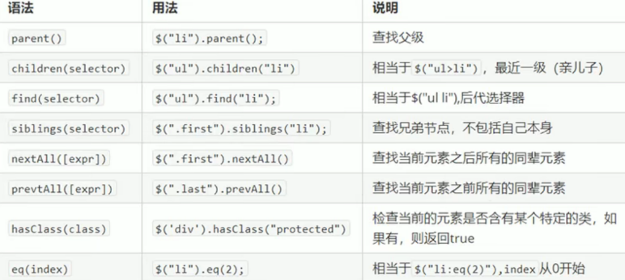
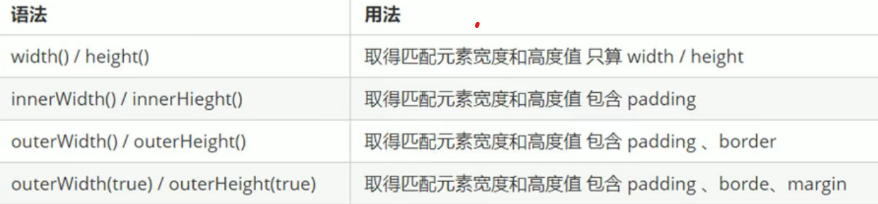

# #目录

>[TOC]

# 一、本地存储
## 1、本地存储特性
（1）数据存储在用户浏览器中
（2）设置，读取方便，甚至页面树信心不丢失数据
（3）容量较大，sessionStorage约5M，localStorage约20M
（4）只能存储字符串，可以将对象JSON.stringify()编码后存储

## 2、window.sessionStorage
（1）生命周期为关闭浏览器窗口；在同一个窗口(页面)下数据可以共享；以键值对的形式存储使用
（2）存储数据：sessionStorage.setItem(key,value)
（3）获取数据：sessionStorage.getItem(key)
（4）删除数据：sessionStorage.removeItem(key)
（4）删除所有数据：sessionStorage.clear()

## 3、window.localStorage
（1）生命周期永久生效，除非手动删除否则关闭页面也会存在；可以多窗口(页面)共享(同意浏览器可以共享)；以键值对的形式存储使用
（2）存储数据：localStorage.setItem(key,value)
（3）获取数据：localStorage.getItem(key)
（4）删除数据：localStorage.removeItem(key)
（4）删除所有数据：localStorage.clear()

# 二、Jquery
## 1、Jquery概述
相当于是JavaScript的库，内部是用JavaScript实现的，用来封装特定的集合(方法和函数)，是将JS的DOM进行了封装

## 2、jQuery的基本使用
（1）入口函数：

```
$(function() {
    .... //此处是页面DOM加载完成的入口
});
例子：
        $(function(){
            $('div').hide();
        })
```
```
$(document).ready(function()){
    ... //此处是页面DOM加载完成的入口
};
例子：
        $(document).ready(function(){
            $('div').hide();
        })
```
等着DOM结构渲染完毕即可执行内部代码，不必等到所有外部资源加载完成，jQuery帮助完成了封装
相当于原生js中的DOMContentLoaded
不同于原生js中的load事件是等页面文档、外部的js文件，css文件，图片加载完毕才执行内部代码

（2）顶级对象$

1 $是JQuary的别称（另外的名字）
2 $同时也是JQuary的**顶级对象**(类似于window)

## 3、Jquery对象和DOM对象
（1）用原生JS获取来的对象就是DOM对象

```
var myDiv = document.querySelector('div'); //myDiv是DOM对象
```
（2）JQuery方法获取的元素就是JQuery对象
```
$('div'); //$('div')是一个jquery对象
```
（3）JQuery对象本质是：利用$对DOM对象包装后产生的对象(是伪数组形式存储的)
JQuery对象只能是以哦那个JQuery方法，DOM对象则只能使用原生的javascript的属性和方法

（4）JQuery和DOM对象的转换
1 DOM对象转换为JQuery对象：$(DOM对象)
```
var myvideo = document.querySelector('video');
$(myvideo) //这里面不需要加引号
```
2 JQuery对象转换为DOM对象（两种方式）：
```
$('div')[index]  //index是索引号
$('div').get(index)
$('video')[0].play()
$('video')get(0).play()
```

# 三、JQuery选择器
## 1、基础选择器和层级选择器
（1）基础选择器：$("选择器") //里面选择器直接写CSS选择器即可，但是要加引号

（2）层级选择器


## 2、隐式迭代(重要)
隐式迭代就是遍历内部DOM元素(伪数组形式存储)的过程
简单理解就是：给匹配到的所有元素进行遍历循环，执行相应的方法，而不用人为再进行循环，简化我们的操作，方便调用

## 3、筛选选择器


```
$function(){
    $('ol li:first').css('color','pink');
}
```

## 4、筛选方法

ps: 由于都是方法，因此都需要加上括号
（1）父 parent()返回的是最近一级的父级元素(亲爸爸)
（2）子 children() 返回的是亲儿子(类似子代选择器 ul>li)
（3）子 find()可以选里面所有的孩子，包括儿子和孙子(类似于后代选择器)
（4）siblings是除了自身元素之外的所有亲兄弟
（5）第n个元素：有两种方法可以使用(下面注释)
**重点记住:parent()、chiledren()、find()、sibilngs()、eq()**

```
$(function(){
    //鼠标经过
    $(".nav>li").mouseover(function() {
        //$(this)代表jquery当前元素，this不要加引号
        //show()表示显示元素  hide()表示隐藏元素
        $(this).children("ul").show();
    });
    //鼠标离开
    $(".nav>li").mouseout(function() {
        $(this).children("ul").hide();
    })
})

//siblings
$("ol .item").siblings("li").css("color","red");

//第n个元素
（1）可以利用选择器的方式选择
$("ul li:eq(2)").css("color","red");
（2）可以利用选择方法的方式选择
$("ul li").eq(2).css("color","red");
```

## 5、案例
（1）排他思想

```
    <button>快速</button>
    <button>快速</button>
    <button>快速</button>
    <button>快速</button>
    <button>快速</button>
    <script>
        //1、隐式迭代 给所有的按钮绑定了点击事件
        $('button').click(function(){
            //2、当前的元素变换背景颜色
            $(this).css('background','pink');
            //3、其余的兄弟去掉背景颜色
            $(this).siblings('button').css('background','');
            //相当于：
            //$(this).css('background','pink').siblings('button').css('background',''); 链式编程
        });
    </script>
```

（2）淘宝服饰精品
核心原理：
1 鼠标经过左侧盒子某个小li，就让内容区盒子相对应图片显示，其余图片隐藏
2 需要得到当前小li的索引号，就可以显示对应索引号的图片
3 JQuery获取当前索引号：**$(this).index()**
4 中间对应的图片可以通过eq(index)方法去选择

# 四、JQuery样式操作
## 1、修改样式之CSS方法

```
(1)参数只写属性名，则是返回属性值
$(this).css('color');

(2)参数是属性名，属性值，逗号分隔，是设置一组样式，属性必须加引号，值如果是数字则可以不用跟单位和引号
$(this).css('color','red');
例子：$('div').css('width',300);  //正确，值可以不加引号
$('div').css(width,300);  //错误，属性名一定要加引号

(3)参数可以是对象形式，方便设置多组样式，属性名和属性值用冒号分隔，属性可以不用加引号
$(this).css({
    color:'white',
    font-size:'20px',
    width:200,
    backgroundColor:'red'});  
    //如果是复合属性则必须采取驼峰命名法，如果值不是数组则需要引号
```

## 2、修改样式之设置类方法
作用等同于以前的classList，可以操作样式，但是注意**里面的参数不要加点(类名选择器)**

```
(1)添加类
$('div').addClass('current');

(2)移除类
$('div').removeClass('current');

(3)切换类
$('div').toggleClass('current');
```
## 3、类操作和className区别
原生JS种className会覆盖元素原先里面的类名
JQuery里面类操作只是对指定类进行操作，不影响原先类名

# 五、JQuery效果
## 1、显示隐藏
（1）显示语法规范：show([speed],[easing],[fn])
（2）显示参数：参数都可以省略，无动画直接显示(一般都不设置动画)
speed:三种预定速度之一的字符串('slow','normal','fast')或表示动画时长的毫秒数值(如:1000)
easing:用来指定切换效果，默认是'swing',可用参数'linear'
fn:回调函数，在动画完成时执行的函数，每个元素执行一次

（3）隐藏语法规范：hide([speed],[easing],[fn])
（4）切换语法规范：toggle([speed],[easing],[fn])

## 2、滑动
（1）slideUp([s],[e],[fn])
（2）slideDown([s],[e],[fn])
（3）slideToggle([s],[e],[fn])

```
事件切换hover就是鼠标经过和离开的复合写法
$(".nav li").hover(function(){
    $(this).children("ul").sildeDown(200);
},function(){
    $(this).children("ul").sildeUp(200);
});

ps:如果事件切换只写一个函数，则代表鼠标经过和离开都会触发这个函数
$(".nav li").hover(function(){
    $(this).children("ul").sildeToggle();
}
```

## 3、动画队列及其停止排队方法
（1）动画或者效果一旦触发就会被执行，如果多次触发，就会造成多个动画或者效果排队执行(凡是动画都有这个问题)
（2）停止排队stop()
ps:stop()方法用于停止动画或者效果
stop()要写到动画或者效果的**前面，相当于停止结束上一次的动画**

```
    $(this).children("ul").stop().sildeToggle();
```

## 4、淡入淡出
（1）淡入：fadeIn([s],[e],[fn])
（2）淡出：fadeOut([s],[e],[fn])
（3）淡入淡出：fadeToggle([s],[e],[fn])
（4）渐进方式调整到指定的不透明度：fadeTo([speed],opacity,[easing],[fn])
ps:opacity透明度必须写，取值在0到1之间

## 5、自定义动画animate
（1）语法：animate(params,[speed],[easing],[fn])
（2）参数：params:想要更改的样式属性，以对象形式传递，必须写。属性名可以不用带引号，如果是复合属性则需要采取驼峰命名法，其余参数都可以省略

```
$function(){
    $('button').click(function(){
        $(this).animate({
            left:200,
            height:300
        })
    })
}
```

# 六、JQuery属性操作
## 1、设置或获取元素固有属性值
元素固有属性就是元素本身自带的属性，比如a里面的href,input里面的type
（1）获取属性语法：prop("属性")
（2）设置属性语法：prop("属性","属性值")

```
        console.log($("a").prop("href"))
```

## 2、设置或获取元素自定义属性值
（1）获取属性语法：attr("属性")  //类似原生getAttribute()
（2）设置属性语法：attr("属性","属性值")  //类似原生setAttribute()

```
        console.log($("div").attr("index"))
```

## 3、数据缓存data()
data()方法可以在指定元素上获取数据，并不会修改DOM元素结构，一旦页面刷新，之前存放的数据都将被溢出
（1）附加数据语法：data("name","value")  //向被选中的元素添加数据
（2）获取数据语法：data("name")  //向被选中的元素获取数据
同时还可以读取HTML5自定义属性data-index,得到的是数字型

```
$("span").data("username","andy")
```
# 七、JQuery文本属性
## 1、普通元素内容html()
语法：html() //获取元素的内容   
html("内容") //设置元素的内容  //相当于原生inner HTML

## 2、普通元素文本内容text()
语法：text() //获取元素的文本内容   
text("内容") //设置元素的文本内容 //相当于原生innerText

## 3、表单的值val() (相当于原生value)
主要针对元素的内容还有表单的值操作

```
console.log($("input").val());
$("input").val("123"); //里面有引号
```

## 4、案例操作知识点
（1）截取字符串是使用substr(1) //里面输入序列号
（2）parents('选择器')可以返回指定祖先元素
（3）计算结果如果想要保留两位小数则可以使用toFixed(2)的方法

# 八、JQuery元素操作
## 1、遍历元素
（1）语法：$("div").each(function(index,domEle) {xxx; })
1.1 each()方法遍历匹配每一个元素；主要是用DOM处理
1.2 里面的回调函数有两个参数：index是每个元素的索引号；demEle是每个DOM元素对象，不是jquery对象（因此如果想要使用jquery方法则需要把dom元素转换为jquery对象）
1.3 JQuery隐式迭代时对同一类元素做了同样的操作；如果想要给同一类元素做不同的操作则需要用到遍历

```
$function(){
    var sum = 0;
    1. each()方法遍历元素
    var arr = ["red","green","blue"];
    $("div").each(function(i,domEle) {
        //回调函数第一个参数一定是索引号 可以自己指定索引号号名称
        //console.log(index);
        console.log(i);
        //回调函数第二个参数一定是 dom元素对象 也是自己命名
        console.log(domEle);
        //domEle.css("color");
        $(domEle).css("color",aii[i]);
        sum += parseInt($(domEle).text());
    })
}
console.log(sum);
```

（2）语法：$.each(object,function(index,element) {xxx; })
2.1 $each()方法可用于遍历任何对象，主要用于数据处理，比如数组，对象
2.2 里面的函数有两个参数：index是每个元素的索引号，element遍历内容

## 2、创建元素

```
语法：$("<li></li>") //动态创建了一个<li>----->创建元素
```

## 3、添加元素
（1）内部添加
element.append("内容") //把内容放在匹配元素内部最后面，类似原生appendChild
element.prepend("内容") //把内容放在匹配元素内部最前面

（2）外部添加
element.after("内容")  //把内容放在目标元素后面
element.before("内容")  //把内容放在目标元素前面
ps:
内部添加元素，生成之后他们是父子关系
外部添加元素生成之后他们是兄弟关系

## 4、删除元素
element.remove() //删除匹配的元素(本身)
element.empty()  //删除匹配的元素集中所有的子节点(孩子)
element.html("") //清空匹配的元素内容(孩子)

## 5、尺寸方法

ps:以上参数为空则是获取相应值，返回的是数字型
如果参数为数字，则是修改相应量
参数可以不必写单位

## 6、位置方法
（1）offset()方法设置或获取元素偏移
offset()方法设置或返回被选元素相对于文档的偏移坐标，和父级没有关系
该方法有两个属性left、top、offset().top用于获取距离文档顶部的距离;offset().left用于获取文档左侧的距离
可以设置元素的偏移：offset({top:10,left:40});

（2）position()获取元素偏移
用于返回被选元素相对于**带有定位的父级**偏移坐标，如果父级没有定位则以文档为准

（3）scrollTop()/scrollLeft()设置或获取元素被卷去的头部和左侧
修改的话只需要在括号里面加上数值即可

（4）案例：返回顶部
```
$(".back").click(function(){
    $("body,html").stop().animate({ //这里是把jquery对象转换为DOM对象
        scrollTop:0 //不能是文档做动画，应该是html和body元素做动画
    });
})
```

# 九、JQuery事件操作
## 1、事件注册
是以前写的element.事件(function{})，但只能对一个对象做一件事情，无法同时做多件事情

##2、事件处理
（1）语法：element.on(events,[selsector],fn)
events:一个或多个用空格分隔的事件类型，例如click或keydown
selector:元素的子元素选择器
fn:回调函数，即绑定在元素身上的侦听函数
好处1：on()方法在匹配元素上可以绑定了一个或多个事件的事件处理函数
```
$("div").on({
    mouseenter:function(){
        $(this).css("background","purple")
    },
        click:function(){
        $(this).css("background","pink")
    }
});
```
（2）好处2：如果事件处理程序相同（同一个对象），可以写在一起
```
$("div").on("mouseenter mouseleave",function(){
        $(this).toggleClass("current")
})
```
（3）好处3：可以事件委派操作；事件委派就是把原来加给子元素身上的事件绑定在父元素身上
```
$("ul").on("click","li",function(){
    alert(11);
})
```

（4）好处4：on可以给未来动态创建的元素绑定事件
```
$("ol").on("click","li",function(){
    alert(11);
})
var li = $("<li>原本ol没有li，这个是后面创建的</li>")
$("ol").append(li);
```

（5）事件解绑off
```
$("div").off(); //这个是解除了div身上的所有事件
$("div").off("click"); //这个是解除了div身上的click事件
$("div").off("click","li");  //解绑事件委托

2. one()事件是只能触发一次
$("div").one("click",function(){
    alert(11)
}); 
```

（6）自动触发事件trigger()
有些事件希望自动触发，比如轮播图的自动播放等
```
语法1：element.click()
$("div").click(); //会触发元素的默认行为

语法2：element.trigger("type")

语法3：元素.triggerHandle("事件") // 和上面两个不同点在于它不会触发元素的默认行为
```
## 3、事件对象
事件被触发，就会有事件对象的产生
语法：element.on(events,[selector],function(event) {})
阻止默认行为：event.preventDefault() 或者return false
阻止冒泡：event.stopPropagation()

# 十、JQuery对象拷贝
如果想要把某个对象拷贝(合并)给另外一个对象使用，此时可以使用$.extent()方法
语法：$.entent([deep],traget,object,[objectN])
deep:如果设为true则为深拷贝，默认是false浅拷贝
（浅拷贝是把拷贝的对象复杂数据类型种的地址拷贝给目标对象，修改目标对象会影响被拷贝对象
深拷贝是把里面的数据完全复制一份给目标对象，如果里面有不冲突的属性则会合并在一起）
target:要拷贝的目标对象
object1:待拷贝到第一个对象的对象
objectN:待拷贝到第N个对象的对象

# 十一、多库共存
解决方法：
（1）如果是$符号冲突，就使用jQuery
（2）让jQuery释放对$控制权，让用户自己决定(相当于jQuery变量规定新的名称:$.noConflict());

